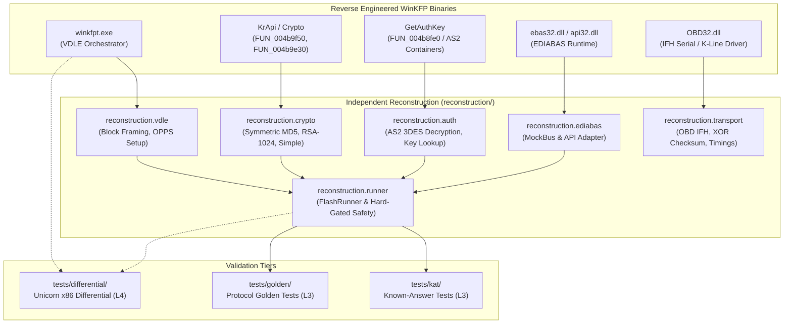

# WinKFP Reverse Engineering & Protocol Reconstruction

[](https://www.python.org/)
[](LICENSE)
[](docs/EVIDENCE.md)
[](docs/ARCHITECTURE.md)

This repository contains the reverse-engineering analysis, technical documentation, clean-room protocol reconstructions, and differential validation suites for the BMW WinKFP automotive ECU flashing software and its associated EDIABAS subsystem.

---

## 1. Executive Summary & Purpose

Modern automotive control units (ECUs) rely on complex vendor-specific diagnostic and bootloader protocols for firmware updating and calibration programming. For decades, BMW's proprietary engineering tools (`WinKFP`, `NFS`, `EDIABAS`, and `INPA`) have served as the de facto standard for flashing engine (DME/DDE) and transmission (EGS, e.g., ZF 6HP) controllers. However, the precise cryptographic handshakes, transport packaging, keepalive timings, and failure-recovery behaviors remained closed and undocumented.

The goal of this research project is to:
1. **Deconstruct the internal protocol stack** of WinKFP (`winkfpt.exe`, `ebas32.dll`, `api32.dll`, `OBD32.dll`, `nfs.exe`) using static binary analysis (Ghidra).
2. **Reconstruct clean-room Python implementations** for the cryptographic authentication (`KrApi`), key storage (`AS2` 3DES containers), flash transport orchestration (`VDLE`), and bus interfacing (`EDIABAS`/`IFH`).
3. **Differentially validate the reconstructions** against the original x86 machine code via hardware-free instruction-level emulation (Unicorn x86) and known-answer test (KAT) suites.
4. **Formalize safety interlocks** preventing unauthorized or dangerous vehicle execution without rigorous precondition verification.

---

## 2. Repository Scope & Critical Boundaries

> [!IMPORTANT]
> **Independent Research Repository**: `winkfp-research` is a standalone public research archive. It is **NOT** a submodule, branch, package, or component of `open6hp` or any active flashing tool.

* **No Physical ECU Flashing**: This repository is an analytical research archive and testbed. Physical in-vehicle ECU contact and reprogramming have **NOT** been validated on physical hardware (see [Evidence Model](#5-evidence-and-validation-model)).
* **Artifact Separation & Redistribution Policy**:
  - **No Original Proprietary Binaries**: No original proprietary OEM binaries (`.exe`, `.dll`, `.prg`, `.ipo`, `.0da`), BMW SP-Daten archives, proprietary ECU firmware images, or production key containers (`SGIDC.as2`, `SGIDD.as2`) are distributed in this repository.
  - **Reverse-Engineering Analysis (`analysis/`)**: Contains behavioral reverse-engineering observations, decompiler-derived C pseudocode, and structural annotations derived from proprietary binaries for research and interoperability analysis.
  - **Independent Reconstruction (`reconstruction/`)**: Contains independently authored Python reimplementations modeling the observed protocols and algorithms.
  - **Public RSA Parameters**: The repository contains public RSA parameters ($N, E$) recovered during reverse engineering. No private RSA exponent or private signing key is included.
* **Privacy Sanitization**: All communication traces and log artifacts have been scrubbed of sensitive identifiers, vehicle identification numbers (VINs), serial numbers, and private key material.

---

## 3. Architecture Overview

The WinKFP protocol stack operates across several distinct software layers, reverse-engineered and reconstructed as follows:



---

## 4. Key Reverse-Engineered Protocols & Algorithms

Detailed technical specifications are located in [`docs/reverse-engineering/`](docs/reverse-engineering/):

### 4.1 KrApi Cryptographic Algorithms
WinKFP implements distinct challenge-response authentication algorithms:
* **Symmetric MD5 Mode** (`FUN_004b9f50`): Uses an 8-byte ECU seed, a 4-byte tester nonce, a 4-byte ECU serial, and a 16-byte shared key (`T_SMA`, `T_SMB`, or `T_SMC`). Produces a 16-byte response key (`SG-Schluessel`). Reconstructed in [`reconstruction/crypto/symmetric/`](reconstruction/crypto/symmetric/).
* **Asymmetric Authentication (RSA-1024 vs RSA-512)**:
  - **KrApi Static Asymmetric Mode** (`FUN_004b9e30`): Computes `MD5(nonce + serial[:4] + seed)`, converts the digest into an integer, and calculates raw modular exponentiation $S = m^e \pmod n$ using static 1024-bit RSA public keys (`RSA_KEYS` slots 3, 4, 5). Post-processes the result through a 32-bit per-dword byteswap (`FUN_004b8a70`). Reconstructed in [`reconstruction/crypto/asymmetric/`](reconstruction/crypto/asymmetric/).
  - **AS2 Container Asymmetric Mode**: Container-based per-ECU keys (e.g. for `GKE191` in `SGIDC.as2`) utilize 512-bit RSA public keys (136-byte / `0x88` structure: 64-byte $N$, 64-byte $E$, word count `0x10`). Reconstructed in [`reconstruction/security.py`](reconstruction/security.py).
* **Simple Mode** (`FUN_004ba080`): A lightweight 8-byte permutation and key-mixing routine used on legacy control units. Reconstructed in [`reconstruction/crypto/simple/`](reconstruction/crypto/simple/).

### 4.2 Key Storage & AS2 Container Parsing
* Runtime keys are read from 3DES-encrypted flat files (`SGIDC.as2`, `SGIDD.as2`) via `GetAuthKey` (`FUN_004b8fe0`).
* The encryption utilizes 3DES in ECB mode with a hardcoded static key.
* Records follow fixed column alignment: `$K <ecu_name:20><ident:4><field6:6><hex_payload>`. Reconstructed in [`reconstruction/as2_keys.py`](reconstruction/as2_keys.py).

### 4.3 VDLE Flash Protocol & Block Framing
* **Sequence**: `INIT_VDLE` $\rightarrow$ `LOADTABLE` $\rightarrow$ `REQUEST_SEGMENTINFO` $\rightarrow$ `SEND_SEGMENT` $\rightarrow$ `FLASH_SCHREIBEN_STATUS`.
* **Block Framing**: Differential execution under Unicorn proved that `FLASH_SCHREIBEN` blocks are formatted with a strict **21-byte header**, followed by the chunk payload and a `0x03` terminator byte:
  ```text
  01 01 00 00 | 00 00 00 00 | 00 FF 00 00 | 00 | [len LE16] | [len LE16] | [addr LE32] | [payload...] | 03
  ```
  *(Notice: The payload length is stored twice as LE16, and the target address is little-endian).*
* **XXL Threshold**: Blocks with size $> 254$ bytes dynamically switch to the `FLASH_SCHREIBEN_XXL` job. Reconstructed in [`reconstruction/vdle/core.py`](reconstruction/vdle/core.py).

### 4.4 EDIABAS Interface & OBD IFH Driver
* `OBD32.dll` implements diagnostic telegram transport over serial K-Line and D-CAN interfaces.
* Reconstructs port initialization, 9600 8E1 (DS2) and 115200 8N1 (KWP) communication, P4 inter-message gaps, telegram framing, and longitudinal redundancy XOR checksum validation. Reconstructed in [`reconstruction/obd_ifh.py`](reconstruction/obd_ifh.py).

### 4.5 Safety Gates & Hard-Gated Interlocks
Flash execution is hard-gated by the `SafetyContext` and provenance-tracked `Limits` structure:
* Refuses execution without a valid limits policy file bound by SHA-256 digest.
* Continuously checks battery voltage ($V_{bat}$), ignition status, programming voltage flags, and ZB number assembly match before sending the first byte to the ECU. Reconstructed in [`reconstruction/safety/hypotheses.py`](reconstruction/safety/hypotheses.py).

---

## 5. Evidence and Validation Model

The project tracks experimental rigor across the canonical eight-tier taxonomy defined in [`docs/EVIDENCE.md`](docs/EVIDENCE.md):

| Level | Designation | Description | Current Status |
|:---:|---|---|:---:|
| **L0** | Static observation | Raw strings, symbol names, table entries in disassembled binaries | Validated (45 functions) |
| **L1** | Decompiled / disassembled behavior | Control flow and data structures analyzed via Ghidra/IDA decompiler output | Validated (45 C files in `analysis/`) |
| **L2** | Independent reconstruction | Python reimplementation of algorithms and protocols | Validated (`reconstruction/`) |
| **L3** | Known-answer / execution validation | Deterministic KAT unit tests comparing against known test vectors | Validated (15 KAT + 10 Golden tests) |
| **L4** | Differential trace validation | Execution of original OEM machine code under Unicorn x86 compared against reconstruction | Validated (8 differential test suites) |
| **L5** | Real EDIABAS integration | Reconstructed engine interacting with EDIABAS API or parsing historical EDIABAS traces | Validated (`traces/sanitized/`, `tools/bench_diff/`) |
| **L6** | Real ECU contact | Diagnostic handshake (ID, auth negotiation, session status) on physical ECU | Not validated |
| **L7** | Real ECU programming | Complete flashing of ECU firmware block on a physical vehicle or hardware bench | Not validated |

> [!CAUTION]
> **No Physical In-Vehicle Flashing**: Writing to automotive flash memory carries severe bricking and safety risks. Physical ECU contact (**L6**) and ECU programming (**L7**) have **NOT** been validated on physical hardware. Controlled/write-free bench test harnesses (`tools/bench_diff/bench_scenario.py`) exist for diagnostic exploration, but physical ECU validation remains unperformed.

---

## 6. Repository Layout

```text
winkfp-research/
├── docs/                           # Technical documentation & RE reports
│   ├── ARCHITECTURE.md             # End-to-end system architecture
│   ├── EVIDENCE.md                 # L0–L7 experimental validation framework
│   ├── METHODOLOGY.md              # Reverse engineering & differential methods
│   ├── PROPRIETARY_MATERIAL.md     # Policy on excluded OEM assets
│   ├── QUARANTINE.md               # Audit history & asset filtering
│   ├── research-source-map.md      # Mapping to historical source workspace
│   ├── history/                    # Historical research progression (Rev 1–18.1)
│   └── reverse-engineering/        # In-depth subsystem specifications
├── analysis/                       # Ghidra decompilation artifacts (45 C files)
│   ├── crypto/                     # Symmetric, asymmetric, and simple algorithms
│   ├── auth/                       # GetAuthKey and AS2 container loaders
│   ├── vdle/                       # VDLE orchestration, block framing, OPPS
│   ├── ediabas/                    # EDIABAS runtime and API handlers
│   └── obd32/                      # OBD32.dll IFH serial driver
├── reconstruction/                 # Clean-room Python protocol implementations
│   ├── crypto/                     # Symmetric MD5, RSA-1024, Simple XOR
│   ├── auth/                       # AS2 3DES parser, key store, retry chain
│   ├── vdle/                       # VDLE flash engine, block builder, OPPS setup
│   ├── ediabas/                    # MockBus, EDIABAS ctypes API adapter
│   ├── transport/                  # OBD IFH driver, telegram framing, timings
│   ├── safety/                     # SafetyContext, Limits policy, interlocks
│   └── runner.py                   # Master FlashRunner orchestration engine
├── tests/                          # Automated verification suites
│   ├── kat/                        # Known-answer tests (crypto, auth, keys)
│   ├── golden/                     # Protocol state machine golden tests
│   ├── differential/               # Unicorn x86 differential runners
│   ├── fixtures/                   # Synthetic containers, limits, and images
│   └── run_tests.py                # Master test runner
├── tools/                          # Analysis, diffing, and sanitization tools
│   ├── bench_diff/                 # L1/L2 event log differential runner
│   ├── trace_parser/               # EDIABAS *.trc parser and VIN sanitizer
│   └── analysis/                   # Master password decoder & SP-Daten scanner
├── traces/                         # Sanitized and expected event logs
│   ├── sanitized/                  # Privacy-sanitized EDIABAS traces
│   └── expected/                   # Standardized benchmark JSONL logs
└── examples/                       # Runnable demonstration scripts
    ├── synthetic_auth/             # Key derivation demo with synthetic vectors
    ├── vdle/                       # VDLE block framing and mock flashing demo
    └── differential/               # Bench log differential comparison demo
```

---

## 7. Reproducibility & Getting Started

### Prerequisites
- Python 3.10 or newer (tested through Python 3.14).
- *Optional for differential execution*: `unicorn` and `pefile` (`pip install unicorn pefile`).

### Running the Test Suite
The repository includes a unified master test runner:

```bash
# Run all verification suites (KAT, Golden, Differential):
python3 tests/run_tests.py

# In a minimal environment without Unicorn or OEM binaries:
# (KAT and Golden tests pass; Differential tests skip cleanly)
python3 tests/run_tests.py
```

### Running Runnable Examples
All examples operate fully independently using synthetic data fixtures:

```bash
# 1. Cryptographic Authentication Demo:
python3 examples/synthetic_auth/demo_auth.py

# 2. VDLE Flash Engine & Block Framing Demo:
python3 examples/vdle/demo_vdle.py

# 3. Differential Event Log Comparison Demo:
python3 examples/differential/demo_diff.py
```

### Running Differential Tests Against Original Binaries (Lab Environment)
If you possess the original binaries in your local research lab, specify their path to execute instruction-level differential verification:

```bash
export WINKFPT_EXE="/path/to/winkfpt.exe"
export OBD32_DLL="/path/to/OBD32.dll"
python3 tests/run_tests.py --tier differential
```

---

## 8. Responsible Disclosure & Security

Automotive control systems operate safety-critical vehicle dynamics. Flashing untrusted code or corrupting non-volatile flash memory can render a vehicle inoperable or unsafe.
- Review [`SECURITY.md`](SECURITY.md) for vulnerability reporting guidelines and safety policies.
- Always observe strict battery voltage maintenance and programming preconditions.

---

## 9. Citation & Academic Attribution

If you utilize this research, reverse-engineering methodology, or reconstructed protocol stack in academic work or software engineering projects, please cite:

```bibtex
@misc{winkfp_research_2026,
  author = {winkfp-research contributors},
  title = {WinKFP Reverse Engineering & Protocol Reconstruction Archive},
  year = {2026},
  publisher = {GitHub},
  howpublished = {\url{https://github.com/Arkayda}}
}
```
See [`CITATION.cff`](CITATION.cff) for full machine-readable metadata.

---

## 10. License & Legal Notice

This project is licensed under the **MIT License** — see [`LICENSE`](LICENSE) for details.

*BMW, WinKFP, EDIABAS, and INPA are registered trademarks of Bayerische Motoren Werke AG (BMW AG). This research repository is an independent reverse-engineering study conducted for interoperability, protocol analysis, and educational purposes under applicable legal provisions. This project is NOT affiliated with, sponsored by, or endorsed by BMW AG or ZF Friedrichshafen AG.*
