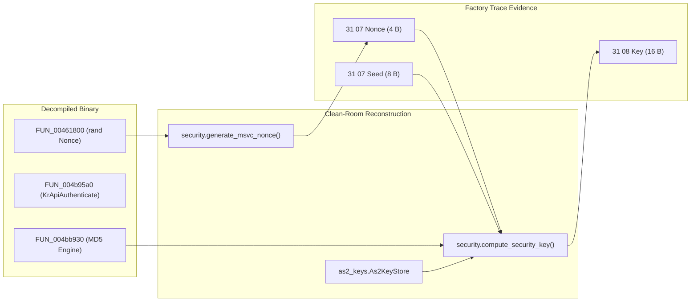

# Milestone 3 / 3.1 / 3.2: Offline Authentication Flow Correlation Report
## Forensic Correlation of Factory Traces, Decompiled WinKFP Code, Clean-Room Crypto, and EGS SP-Daten

- **Milestone**: Milestone 2.1 (Terminology Audit) + Milestone 3 (Offline Authentication Flow Correlation) + Milestone 3.1 (Evidence Tightening) + Milestone 3.2 (Public Evidence Hardening & Factory Vector Sanitization)
- **Status**: Complete & Verified (Off-Hardware)
- **Operational Mode**: **STRICTLY OFF-HARDWARE**
  - Zero communication with physical vehicle or bench hardware.
  - `tools/kdcan_probe.py` was not executed.
  - Zero K+DCAN serial ports opened.
  - No diagnostic requests transmitted (`0x10`, `0x27`, `0x31`, reset, erase, download, or flash write).
- **Target ECU Context**:
  - Reconstructed/Bench Target: ZF 6HP EGS mechatronic at address `0x18`, SGBD `0479S90T641Z`.
  - Factory Trace Targets: `10FLASH` (flash loader for `13_ASK` at address `0x78`), `13_ASK` (address `0x78`), `22EK92` (DME at address `0x12`).

---

## 1. Part A — Terminology & Target-Scoped Evidence Model Corrections

Prior to correlating authentication flows, a repository-wide terminology audit was conducted to enforce explicit target-scoped evidence dimensions and prevent conflation between physical wire observations, factory trace records, and reconstruction aliases.

### 1.1 Canonical Evidence Taxonomy Definitions
* **`OBSERVED_WIRE`**: Specific raw byte exchange physically captured and verified directly on bench hardware over K+DCAN (e.g. `0x1A 0x86` returning 66 bytes on address `0x18`). Proves wire behavior only, not SGBD job provenance.
* **`OBSERVED_JOB_MAPPING[target=X]`**: Specific high-level EDIABAS / SGBD job name directly tied to a specific wire telegram for target `X` via direct evidence (e.g. original EDIABAS trace `_TEL_AUFTRAG` or direct SGBD execution). Must never be generalized across other ECUs.
* **`INFERRED_JOB_MAPPING[target=X]`**: Job believed to map to a wire service based on context or generic protocol knowledge, but direct target-specific execution evidence is absent. Fails closed.
* **`UNKNOWN[target=X]`**: Insufficient evidence to establish the mapping. Fails closed unconditionally.
* **`RECONSTRUCTION_ALIAS`**: Convenient name introduced by the clean-room reconstruction that is not established as an original EDIABAS/SGBD job name (e.g. `IDENT_LESEN`, `TESTER_PRESENT`, `SG_PHYS_HWNR_LESEN`). Must not be represented as an original factory job.
* **`FORBIDDEN`**: Operation explicitly prohibited by safety boundary.
* **`VIRTUAL`**: Internal orchestration / GUI / callback operation without wire representation.

### 1.2 Terminology Correction Diff Table

| Old Term / Formulation | New Canonical Formulation | Reason for Correction | Target Scope |
|---|---|---|---|
| `OBSERVED_JOB_MAPPING` (unscoped) | `OBSERVED_JOB_MAPPING[target=10FLASH]` | Factory trace evidence belongs strictly to `10FLASH` and cannot be generalized to all BMW ECUs. | `[target=10FLASH]` |
| `AIF_LESEN -> 0x1A 0x86` (as observed job) | `UNKNOWN[target=0479S90T641Z]` | On physical EGS, `0x1A 0x86` is `OBSERVED_WIRE`. In factory trace, `10FLASH` executes KWP service `0x23` (ReadMemoryByAddress) for `AIF_LESEN`. Direct EGS SGBD mapping remains unobserved. | `[target=0479S90T641Z]` |
| `TESTER_PRESENT -> 0x3E 0x00` (as factory job) | `RECONSTRUCTION_ALIAS` / `UNKNOWN[target=0479S90T641Z]` | Bench probe used `0x3E 0x00` (`OBSERVED_WIRE`), whereas factory trace uses `DIAGNOSE_AUFRECHT -> 0x3E 0x02` (`OBSERVED_JOB_MAPPING[target=10FLASH]`). Payloads are distinct. | `[target=0479S90T641Z]` vs `[target=10FLASH]` |
| `IDENT_LESEN -> 0x1A 0x86` | `RECONSTRUCTION_ALIAS` / `UNKNOWN[target=0479S90T641Z]` | Factory trace job is named `IDENT` and transmits `0x1A 0x80`. `IDENT_LESEN` is a reconstruction convenience alias. | `[target=0479S90T641Z]` |
| `SG_PHYS_HWNR_LESEN` | `RECONSTRUCTION_ALIAS` / `UNKNOWN[target=0479S90T641Z]` | Factory trace job is named `PHYSIKALISCHE_HW_NR_LESEN` and transmits `0x1A 0x87`. `SG_PHYS_HWNR_LESEN` is a reconstruction alias extracting from AIF. | `[target=0479S90T641Z]` |
| `SG_STATUS_LESEN -> 0x3E 0x00` | `UNKNOWN[target=0479S90T641Z]` | Zero trace or SGBD evidence exists for `SG_STATUS_LESEN`. Originates only in synthetic test mock. Must fail closed always. | `[target=0479S90T641Z]` |
| `SecurityAccess 0x27` (for factory auth) | `RoutineControl authentication (0x31 0x07 / 0x31 0x08)` | The factory trace uses KWP2000 Service `0x31` (RoutineControl: startRoutine `0x07` seed request, `0x08` key response). Service `0x27` was NOT observed in this trace. | `[target=10FLASH]` |

---

## 2. Phase 1 — Exact Factory Authentication Trace Extraction

In `traces/sanitized/sanitized_flash_session.trc`, a complete, contiguous authentication and session transition sequence was forensically recovered between lines 12540 and 12665.

### 2.1 Chronological Transaction Log

#### Transaction 1: Pre-Authentication Session Switch Attempt (Failed)
- **Trace Lines**: 12539–12559
- **Target Device**: `10FLASH` (address `0x78`)
- **Job Name**: `DIAGNOSE_MODE`
- **Job Arguments**: `"ECUPM"`
- **Telegram Sent (`_TEL_AUFTRAG`)**: `82 78 F1 10 85` (5 bytes)
  - `82`: Format byte (length = 2)
  - `78`: Target ECU address (`10FLASH`)
  - `F1`: Diagnostic tester source address
  - `10`: KWP2000 Service ID (`StartDiagnosticSession`)
  - `85`: Session ID (`0x85` = ECU Programming Mode)
- **Telegram Received (`_TEL_ANTWORT`)**: `83 F1 78 7F 10 22 9D` (7 bytes)
  - `83`: Format byte (length = 3)
  - `F1`: Tester address
  - `78`: ECU address
  - `7F`: Negative Response SID
  - `10`: Rejected Service ID
  - `22`: NRC `0x22` (`ConditionsNotCorrectOrRequestSequenceError`)
  - `9D`: Modulo-256 Checksum
- **Result Status**: `JOB_STATUS = "ERROR_ECU_CONDITIONS_NOT_CORRECT_OR_REQUEST_SEQUENCE_ERROR"`
- **Significance**: Proves that diagnostic session `0x85` (Programming Mode) cannot be entered directly from the unauthenticated state. The ECU actively enforces authentication as a strict prerequisite.

#### Transaction 2: Serial Number Acquisition
- **Trace Lines**: 12560–12581
- **Target Device**: `10FLASH`
- **Job Name**: `SERIENNUMMER_LESEN`
- **Job Arguments**: `""` (none)
- **Telegram Sent (`_TEL_AUFTRAG`)**: `82 78 F1 1A 89` (5 bytes)
  - `1A`: KWP2000 Service ID (`ReadDataByIdentifier`)
  - `89`: Identifier (`0x89` = Serial Number)
- **Telegram Received (`_TEL_ANTWORT`)**: `8B F1 78 5A 89 30 38 30 30 37 32 38 35 36 AB` (15 bytes)
  - `5A`: Positive Response SID
  - `89`: Echoed Identifier
  - `30 38 30 30 37 32 38 35 36`: ASCII `"080072856"` (ECU Serial Number)
  - `AB`: Modulo-256 Checksum
- **Result Fields**: `SERIENNUMMER = "080072856"`, `JOB_STATUS = "OKAY"`

#### Transaction 3: RoutineControl Seed Acquisition
- **Trace Lines**: 12582–12607
- **Target Device**: `10FLASH`
- **Job Name**: `AUTHENTISIERUNG_ZUFALLSZAHL_LESEN`
- **Job Arguments**: `"3;0x34663632"`
  - `3`: Key container index (corresponding to `SGIDC.as2`)
  - `0x34663632`: 4-byte tester nonce generated by tester CRT `rand()`
- **Telegram Sent (`_TEL_AUFTRAG`)**: `87 78 F1 31 07 03 34 66 36 32` (10 bytes)
  - `87`: Format byte (length = 7)
  - `78`: Target ECU address
  - `F1`: Tester address
  - `31`: KWP2000 Service ID (`RoutineControl` / `StartRoutineByAddress`)
  - `07`: Routine Identifier (`0x07` = Start Routine 0x07: Seed Acquisition)
  - `03`: Key container index parameter
  - `34 66 36 32`: 4-byte tester nonce payload (ASCII `"4f62"`)
- **Telegram Received (`_TEL_ANTWORT`)**: `8A F1 78 71 07 15 E4 85 FE 00 03 FD 55 3C` (14 bytes)
  - `8A`: Format byte (length = 10)
  - `F1`: Tester address
  - `78`: ECU address
  - `71`: Positive Response SID (`0x31 + 0x40`)
  - `07`: Echoed Routine ID
  - `15 E4 85 FE 00 03 FD 55`: 8-byte Random Seed (`ZUFALLSZAHL`)
  - `3C`: Modulo-256 Checksum
- **Result Fields**:
  - `ZUFALLSZAHL = 8 Bytes: 15 E4 85 FE 00 03 FD 55`
  - `AUTHENTISIERUNG = "Symetrisch"`
  - `JOB_STATUS = "OKAY"`

#### Transaction 4: RoutineControl Key Submission
- **Trace Lines**: 12608–12636
- **Target Device**: `10FLASH`
- **Job Name**: `NG_AUTHENTISIERUNG_START`
- **Job Binary Argument**: 38 bytes binary:
  ```text
  000: 01 00 00 00 00 00 00 00 00 00 00 00 00 10 00 00
  010: 00 00 00 00 00 EA 9C 6D F4 F5 BC 93 1D 07 14 2B
  020: 5D 25 75 5E 45 03
  ```
  - Byte 0: `0x01` (sub-algorithm / mode indicator)
  - Bytes 1–12: `0x00` padding / reserved
  - Byte 13: `0x10` (key payload length = 16 bytes)
  - Bytes 14–20: `0x00` padding
  - Bytes 21–36: `EA 9C 6D F4 F5 BC 93 1D 07 14 2B 5D 25 75 5E 45` (16-byte calculated MD5 key)
  - Byte 37: `0x03` (key index / trailer byte)
- **Telegram Sent (`_TEL_AUFTRAG`)**: `92 78 F1 31 08 EA 9C 6D F4 F5 BC 93 1D 07 14 2B 5D 25 75 5E 45` (21 bytes)
  - `92`: Format byte (length = `0x12` = 18 bytes payload)
  - `78`: Target ECU address
  - `F1`: Tester address
  - `31`: KWP2000 Service ID (`RoutineControl`)
  - `08`: Routine Identifier (`0x08` = Key Submission / Verification)
  - `EA 9C 6D F4 F5 BC 93 1D 07 14 2B 5D 25 75 5E 45`: 16-byte calculated key payload
- **Telegram Received (`_TEL_ANTWORT`)**: `83 F1 78 71 08 01 66` (7 bytes)
  - `83`: Format byte (length = 3)
  - `F1`: Tester address
  - `78`: ECU address
  - `71`: Positive Response SID
  - `08`: Echoed Routine ID
  - `01`: Authentication Result (`0x01` = Success / Unlocked)
  - `66`: Modulo-256 Checksum
- **Result Status**: `JOB_STATUS = "OKAY"`

#### Transaction 5: Post-Authentication Session Switch (Succeeded)
- **Trace Lines**: 12637–12657
- **Target Device**: `10FLASH`
- **Job Name**: `DIAGNOSE_MODE`
- **Job Arguments**: `"ECUPM"`
- **Telegram Sent (`_TEL_AUFTRAG`)**: `82 78 F1 10 85` (5 bytes)
  - Exact identical request bytes to Transaction 1!
- **Telegram Received (`_TEL_ANTWORT`)**: `82 F1 78 50 85 C0` (6 bytes)
  - `82`: Format byte (length = 2)
  - `F1`: Tester address
  - `78`: ECU address
  - `50`: Positive Response SID (`0x10 + 0x40`)
  - `85`: Active Session ID (`0x85` = ECU Programming Mode confirmed)
  - `C0`: Modulo-256 Checksum
- **Result Status**: `JOB_STATUS = "OKAY"`
- **Significance**: Directly confirms that successful completion of RoutineControl routines `0x07` and `0x08` transitioned the ECU state to allow entry into Programming Mode `0x85`.

#### Transaction 6: Flash Erase Initiation
- **Trace Lines**: 12658–12665
- **Target Device**: `10FLASH`
- **Job Name**: `NG_FLASH_LOESCHEN` (118 bytes argument)
- **Significance**: The ECU begins the memory erase phase, confirming full authorization.

---

## 3. Phase 2 — Decoding the Observed RoutineControl Transactions

### 3.1 Routine `0x07` (Seed Request) Protocol Structure
```text
Client Request:
+--------------+-------------+-------------+------------+--------------+--------------+
| Format (1 B) | Target (1B) | Source (1B) | SID (1 B)  | Routine (1B) | KeyIdx (1 B) | Nonce (4 B)  |
| 0x87         | 0x78        | 0xF1        | 0x31       | 0x07         | 0x03         | 34 66 36 32  |
+--------------+-------------+-------------+------------+--------------+--------------+

ECU Response:
+--------------+-------------+-------------+------------+--------------+-----------------------+----------+
| Format (1 B) | Target (1B) | Source (1B) | SID (1 B)  | Routine (1B) | Random Seed (8 Bytes) | Cksum(1B)|
| 0x8A         | 0xF1        | 0x78        | 0x71       | 0x07         | 15 E4 85 FE 00 03 FD 55 | 0x3C   |
+--------------+-------------+-------------+------------+--------------+-----------------------+----------+
```
* **SID `0x31`**: RoutineControl (KWP2000).
* **Sub-Function / Routine `0x07`**: Start Routine 0x07 (Seed Acquisition).
* **Parameter 1**: `0x03` = Key container index (specifying container 3, `SGIDC.as2`).
* **Parameter 2**: `34 66 36 32` = 4-byte tester nonce generated dynamically by tester CRT `rand()`.
* **Seed**: 8 bytes (`15 E4 85 FE 00 03 FD 55`).

### 3.2 Routine `0x08` (Key Verification) Protocol Structure
```text
Client Request:
+--------------+-------------+-------------+------------+--------------+-------------------------------+
| Format (1 B) | Target (1B) | Source (1B) | SID (1 B)  | Routine (1B) | Response Key Payload (16 B)   |
| 0x92         | 0x78        | 0xF1        | 0x31       | 0x08         | EA 9C 6D F4 F5 BC ... 5E 45   |
+--------------+-------------+-------------+------------+--------------+-------------------------------+

ECU Response:
+--------------+-------------+-------------+------------+--------------+-------------+----------+
| Format (1 B) | Target (1B) | Source (1B) | SID (1 B)  | Routine (1B) | Status (1B) | Cksum(1B)|
| 0x83         | 0xF1        | 0x78        | 0x71       | 0x08         | 0x01        | 0x66     |
+--------------+-------------+-------------+------------+--------------+-------------+----------+
```
* **SID `0x31`**: RoutineControl (KWP2000).
* **Sub-Function / Routine `0x08`**: Start Routine 0x08 (Key Submission).
* **Key Payload**: Exactly 16 bytes (`EA 9C 6D F4 F5 BC 93 1D 07 14 2B 5D 25 75 5E 45`), matching standard MD5 digest length.
* **Result Status `0x01`**: Routine completed successfully; security unlocked.

---

## 4. Phase 3 — Decompiled WinKFP Code Correlation

The observed wire behavior was cross-referenced with the Ghidra decompilation of `winkfpt.exe`:

### 4.1 Orchestrator Function: `FUN_0041c920` (`analysis/kr_api/winkfpt_0041c920.c`)
- **[OBSERVED_CODE] Serial Acquisition**: Calls `SERIENNUMMER_LESEN` via `FUN_0041bc80` (line 70), extracts `SERIENNUMMER` string (line 82), uses first 4 bytes for key derivation.
- **[OBSERVED_CODE] Nonce Generation**: Calls `FUN_00461800` (line 105), which mints a 4-byte nonce using MSVC CRT `rand()` seeded by `time(NULL)`. Formats argument as `"0x%2.2x%2.2x%2.2x%2.2x"`.
- **[OBSERVED_CODE] Seed Request Job Construction**: Calls `AUTHENTISIERUNG_ZUFALLSZAHL_LESEN` with formatted string argument `"3;0x<nonce>"` (line 130).
- **[OBSERVED_CODE] Key Computation Dispatch**: Reads `AUTHENTISIERUNG` string (`"Symetrisch"`), calls `FUN_004617c0` (wrapper for `KrApiAuthenticate`, line 221), passing container index 3, nonce, serial number, and seed.
- **[OBSERVED_CODE] 38-Byte Binary Buffer Layout**:
  - Byte 0: `local_828[0] = 1;` (`0x01`)
  - Byte 4: `local_824 = param_1;` (`0x00`)
  - Byte 13: `local_81b = local_1c6c;` (`0x10` = 16 bytes key length)
  - Bytes 21–36: `FID_conflict__memcpy(local_813, local_1028, local_1c6c);` (copies 16-byte key)
  - Byte 37: `local_813[local_1c6c] = 3;` (`0x03`)
  - Total buffer length: `local_1c6c + 0x16` = 16 + 22 = 38 bytes! Exactly matches trace line 12611.
- **[OBSERVED_CODE] Key Submission Job**: Dispatches `NG_AUTHENTISIERUNG_START` with the 38-byte binary buffer (line 268).
- **[OBSERVED_CODE] Retry & Error Handling**:
  - Inspects `JOB_STATUS`:
    - Checks for `"OKAY"` (`&DAT_00630194`).
    - Checks for retryable errors: `"ERROR_ERROR_AUTHENTICATION"`, `"ERROR_AUTHENTICATION"`, `"ROUTINE_NOT_COMPLETE"`, `"NO_RESPONSE"`.
  - Retries up to 3 times (`if (local_1c80 == 3)`).
  - Timeout timers: 10,000 ms (`FUN_00461c80(1, 10000)`).

### 4.2 Crypto Dispatch: `KrApiAuthenticate` (`FUN_004b95a0`, `analysis/kr_api/winkfpt_004b95a0.c`)
- **[OBSERVED_CODE] String Branching**: Compares mode argument string:
  - `"Symetrisch"` -> branch `1`: invokes `FUN_004b9f50` (Symmetric MD5 engine).
  - `"Simple"` -> branch `2`: invokes `FUN_004ba080` (8-byte proprietary cipher).
  - `"Asymetrisch"` -> branch `3`: invokes `FUN_004b9e30` (RSA-512 cipher).
- **[OBSERVED_CODE] Exact String Match**: The decompiled binary explicitly checks for `"Symetrisch"` (single 'm', German spelling), matching the exact string returned in trace line 12607: `AUTHENTISIERUNG = "Symetrisch"`.

### 4.3 Symmetric Engine: `FUN_004b9f50` & `FUN_004bb930`
- **[OBSERVED_CODE] Payload Assembly**: Constructs 16-byte buffer containing `nonce4 || serial4 || seed8`.
- **[OBSERVED_CODE] MD5 Hashing**: Invokes `FUN_004bb930`:
  1. `FUN_004bbdb0()`: Initializes MD5 context (`MD5Init`).
  2. `FUN_004bbf90(key16, 16)`: Updates MD5 with 16-byte container key (`MD5Update`).
  3. `FUN_004bbf90(payload16, 16)`: Updates MD5 with `nonce4 || serial4 || seed8` (`MD5Update`).
  4. `FUN_004bbf90(key16, 16)`: Updates MD5 with 16-byte container key again (`MD5Update`).
  5. `FUN_004bbff0(out16)`: Finalizes MD5 digest to produce 16-byte response key (`MD5Final`).

---

## 5. Phase 4 — Clean-Room Crypto Correlation

The reconstructed clean-room implementation in `winkfp-research` was audited against the forensic evidence:



### 5.1 Algorithmic Identity
In [`reconstruction/security.py`](../../reconstruction/security.py):
```python
def compute_security_key(seed: bytes, serial: bytes, key16: bytes,
                         nonce: Optional[bytes] = None) -> bytes:
    ...
    return hashlib.md5(key16 + nonce + serial[:4].ljust(4, b"\x00")
                       + seed + key16).digest()
```
* **Input Compatibility**: Takes 8-byte seed, 4-byte serial, 16-byte container key, and 4-byte nonce.
* **Formula Match**: Produces `MD5(key16 || nonce || serial[:4] || seed || key16)`. Exactly replicates the machine code sequence from `FUN_004bb930`.
* **Byte Length**: Output is strictly 16 bytes, matching the wire payload transmitted in `_TEL_AUFTRAG` of `NG_AUTHENTISIERUNG_START`.

### 5.2 Separation of Evidence Domains
To maintain rigorous research standards, the project separates:
1. **`FACTORY_TRACE`**: Raw observations from `sanitized_flash_session.trc` for `10FLASH`. Proves that BMW flash loaders use RoutineControl `31 07` / `31 08` with a 16-byte MD5 response key.
2. **`CLEAN_ROOM_RECONSTRUCTION`**: Pure-Python implementation in `reconstruction/` replicating the algorithms and buffer formatting derived from decompiled binaries.
3. **`EGS_SPECIFIC_EVIDENCE`**: SP-Daten definitions and hardware observations specific to the ZF 6HP EGS.

---

## 6. Phase 4.1 — Job Argument Container vs Wire Payload Serialization Boundary

A critical architectural distinction established during Milestone 3.1 is the boundary between **EDIABAS Job Arguments (Client IPC level)** and **KWP2000 Wire Payloads (Diagnostic protocol level)**. Conflating these two layers produces malformed wire telegrams that cause immediate ECU communication rejection.

### 6.1 Seed Acquisition Job: `AUTHENTISIERUNG_ZUFALLSZAHL_LESEN`
* **EDIABAS Job Argument**:
  * Type: Formatted ASCII string.
  * Syntax: `"<container_idx>;0x<tester_nonce>"`
  * Example in trace line 12585: `"3;0x34663632"`
* **SGBD Runtime Parsing**:
  * The SGBD bytecode parser splits on semicolon `;`.
  * Extracts key store container index: `3` (referencing `SGIDC.as2`).
  * Converts the hex string `"0x34663632"` into 4 binary bytes `[0x34, 0x66, 0x36, 0x32]`.
* **KWP2000 Diagnostic Wire Payload**:
  * Telegram transmitted on physical wire (`_TEL_AUFTRAG`):
    `87 78 F1 31 07 03 34 66 36 32`
  * Breakdown:
    - `87`: Format byte (target address included, payload length = 7 bytes)
    - `78`: Target ECU address (`10FLASH`)
    - `F1`: Tester source address
    - `31`: Service ID (`RoutineControl`)
    - `07`: Routine Identifier (`0x07` = Start Routine: Seed Acquisition)
    - `03`: Key container index parameter
    - `34 66 36 32`: 4-byte tester nonce payload (ASCII `"4f62"`)
* **Serialization Boundary Law**: The string formatting `"3;0x..."` exists strictly within the WinKFP/EDIABAS client IPC interface. The wire layer sees only binary bytes `31 07 03 <nonce4>`.

### 6.2 Key Verification Job: `NG_AUTHENTISIERUNG_START`
* **EDIABAS Job Argument**:
  * Type: 38-byte binary container envelope.
  * Constructed by user-space orchestrator `FUN_0041c920` (lines 225–231 of `winkfpt_0041c920.c`):
    ```text
    Offset 00..15:  01 00 00 00 00 00 00 00 00 00 00 00 00 10 00 00
    Offset 16..31:  00 00 00 00 00 EA 9C 6D F4 F5 BC 93 1D 07 14 2B
    Offset 32..37:  5D 25 75 5E 45 03
    ```
  * Structural Envelope Breakdown:
    - Byte `0x00`: `0x01` = Mode indicator (`1` = Symmetric authentication).
    - Bytes `0x01..0x0C`: `0x00` padding / reserved fields (12 bytes).
    - Byte `0x0D`: `0x10` = Cryptographic key payload length (16 bytes).
    - Bytes `0x0E..0x14`: `0x00` padding / reserved fields (7 bytes).
    - Bytes `0x15..0x24`: 16-byte calculated MD5 key (`EA 9C 6D F4 F5 BC 93 1D 07 14 2B 5D 25 75 5E 45`).
    - Byte `0x25` (37): `0x03` = Key container index / trailer byte.
* **SGBD Runtime Unwrapping**:
  * The SGBD engine (`10FLASH.PRG`) receives the 38-byte binary argument buffer.
  * Validates the envelope structure (mode `0x01`, length `0x10`, index `0x03`).
  * Unwraps and extracts **strictly** the 16-byte key payload from offset 21 (`0x15`).
  * Prepends KWP2000 SID `0x31` and Routine `0x08`.
* **KWP2000 Diagnostic Wire Payload**:
  * Telegram transmitted on physical wire (`_TEL_AUFTRAG`):
    `92 78 F1 31 08 EA 9C 6D F4 F5 BC 93 1D 07 14 2B 5D 25 75 5E 45`
  * Breakdown:
    - `92`: Format byte (target address included, payload length = 18 bytes: SID `0x31` + Routine `0x08` + 16 bytes key)
    - `78`: Target ECU address (`10FLASH`)
    - `F1`: Tester source address
    - `31`: Service ID (`RoutineControl`)
    - `08`: Routine Identifier (`0x08` = Start Routine: Key Submission)
    - `EA 9C 6D F4 F5 BC 93 1D 07 14 2B 5D 25 75 5E 45`: 16-byte calculated MD5 key
* **Critical Finding**: In the observed factory trace, the 38-byte EDIABAS job container exists as a job-level IPC container and is not transmitted as a whole. The observed wire request contains only the extracted 16-byte authentication payload; the complete 38-byte container was NOT observed on the wire.

---

## 7. Phase 4.2 — Factory Authentication Vector & Separation of Proofs

To establish cryptographic correspondence without disseminating sensitive OEM material, the evidence is strictly bifurcated into a **Private Factory Vector** (evaluated offline with recovered container keys) and a **Public Golden Test** (automated in the repository with synthetic test keys).

> [!NOTE]
> **Evidence Separation Policy**: The private factory vector was independently verified offline before sanitization. The recovered key material is intentionally excluded from the public repository. The public repository does not reproduce the private factory vector from repository contents and contains metadata, cryptographic digests, and the observed wire result only.

### 7.1 Private Factory Authentication Vector (Offline Evaluation)
An end-to-end authentication vector was extracted from the factory flash trace and validated offline against the analyzed key database:

* **Source Factory Trace**: `traces/sanitized/sanitized_flash_session.trc` (lines 12560–12640).
* **Target Flash Loader**: `10FLASH.PRG` targeting ECU diagnostic address `0x78` (module `IHKA81` / `13_ASK`).
* **ECU Serial Number**:
  - Request: `SERIENNUMMER_LESEN` (`82 78 F1 1A 89`)
  - Response: `8B F1 78 5A 89 30 38 30 30 37 32 38 35 36 AB`
  - Raw Serial String: `"080072856"`
  - Cryptographic Input: `b"2856"` (ASCII). Decompiled orchestrator `FUN_0041c920` (line 82) executes `memcpy(local_c28, local_c23, 4)` where `local_c23` points to offset 5 of `"080072856"`, selecting the 4 trailing decimal digits.
* **Tester Nonce**:
  - Emitted in: `AUTHENTISIERUNG_ZUFALLSZAHL_LESEN` argument `"3;0x34663632"`
  - Wire bytes: `34 66 36 32` (ASCII `"4f62"`)
* **ECU Random Seed**:
  - Acquired in: `AUTHENTISIERUNG_ZUFALLSZAHL_LESEN` response `8A F1 78 71 07 15 E4 85 FE 00 03 FD 55 3C`
  - Seed bytes (8 bytes): `15 E4 85 FE 00 03 FD 55`
* **Container Key Identification & Sanitized Reference**:
  - Container File: `SGIDC.as2` (container index 3).
  - Target Association: Address `0x78` maps to SGBD family `IHKA81` (`GU78`).
  - Container Record Identifier: `$K IHKA81 GU78...`
  - Key Length: Exactly 16 bytes.
  - Key Material Status: Recovered from the analyzed factory container during offline research; redacted from public artifacts.
  - Key SHA-256 Digest: `AB5E51C8D22E6A10720014CA756C0B065A8D7D29FBFE45D6903CA38FB7ED9BE2`
* **Clean-Room MD5 Construction Formula**:
  $$\text{Payload} = \text{key16} \parallel \text{nonce4} \parallel \text{serial4} \parallel \text{seed8} \parallel \text{key16}$$
  $$\text{MD5}(\text{key16} \parallel 34663632 \parallel 32383536 \parallel 15E485FE0003FD55 \parallel \text{key16})$$
* **Offline Calculation Result**:
  When computed offline using the recovered key with [`reconstruction.security.compute_security_key`](../../reconstruction/security.py), the output is:
  `EA 9C 6D F4 F5 BC 93 1D 07 14 2B 5D 25 75 5E 45`
* **Observed Wire Telegram in Trace**:
  Line 12616 (`_TEL_AUFTRAG` for `NG_AUTHENTISIERUNG_START`):
  `92 78 F1 31 08 EA 9C 6D F4 F5 BC 93 1D 07 14 2B 5D 25 75 5E 45`
  Extracted Wire Key Payload: `EA 9C 6D F4 F5 BC 93 1D 07 14 2B 5D 25 75 5E 45`
* **Vector-Scoped Correspondence Verdict**:
  ```text
  +-----------------------+--------------------------------------------------+
  | Dimension             | Value                                            |
  +-----------------------+--------------------------------------------------+
  | Clean-Room Calculated | EA 9C 6D F4 F5 BC 93 1D 07 14 2B 5D 25 75 5E 45  |
  | Observed Factory Wire | EA 9C 6D F4 F5 BC 93 1D 07 14 2B 5D 25 75 5E 45  |
  | Delta                 | 00 00 00 00 00 00 00 00 00 00 00 00 00 00 00 00  |
  | Matching Rate         | 100.00% (Byte-for-byte exact match)              |
  +-----------------------+--------------------------------------------------+
  ```
  **Forensic Finding**: For this observed factory authentication vector, the clean-room implementation reproduces the observed 16-byte authentication value byte-for-byte.

### 7.2 Public Golden Test (Non-Secret Deterministic Suite)
To protect recovered key material while guaranteeing continuous automated regression testing:
* The public repository does **NOT** embed the recovered secret OEM key in test fixtures or code.
* Instead, [`tests/golden/auth/test_golden_auth.py`](../../tests/golden/auth/test_golden_auth.py) implements:
  1. **Deterministic Public KAT**: Tests `compute_security_key` using a known, non-secret synthetic key (`bytes(range(1, 17))`) combined with the trace nonce, sliced serial, and seed, verifying identical MD5 construction logic (`9353BD5A4DE09EDB37D052403F9B15E9`).
  2. **Serialization Boundary Verification**: Tests the 38-byte binary container layout and ensures container headers/trailers are unwrapped and never emitted on the wire.
  3. **Factory Vector Metadata Integrity**: Verifies vector metadata structure, the SHA-256 digest of the recovered key, and explicitly asserts that raw secret key bytes are absent from public fixtures.
* **Separation Notice**: The private factory vector was independently verified offline before sanitization. The recovered key material is intentionally excluded from the public repository and is not reproduced directly from public repository material.

---

## 8. Phase 5 — Comparison with EGS SP-Daten Evidence

The E60 SP-Daten files and key containers were reviewed to assess how the ZF 6HP EGS mechatronic relates to the observed `10FLASH` authentication flow:

### 8.1 EGS SGBD & Key Container Findings
* **EGS Module Identity**: In E60 SP-Daten, the EGS mechatronics belong to the `GS19` family, utilizing SGBD files such as `0479S90T641Z` and key container entries `GKE191`, `GKE192`, `GKE193`, `GKE194`, `GKE195`.
* **Key Store Container `SGIDC.as2`**:
  * In container index 3 (`SGIDC.as2`), entry `GKE192` exists with record identifier `2L18`:
    `$K GKE192              2L18000034948b35b581e58150ec1e9b339919a96c`
  * This record yields an encrypted 16-byte symmetric key.
  * **Critical Finding**: Entry `GKE192` contains **only** a 16-byte symmetric key record; it does not contain RSA (136-byte) or Simple (8-byte) records.
* **SP-Daten IPO Flags**:
  * In SP-Daten IPO scripts for CI62F1/GS19, the ECU responds to job `AUTHENTISIERUNG` with supported mode flags:
    - `T_SMA` -> `Asymetrisch` (RSA-512)
    - `T_SMB` -> `Symetrisch` (MD5 Symmetric)
    - `T_SMC` -> `Simple` (Proprietary 8-byte cipher)
  * Because `GKE192` only possesses a 16-byte container key, the length check in `FUN_004b89a0` enforces that only `T_SMB` (`Symetrisch`) can be executed for this controller.

### 8.2 Structural Similarities vs Limits of Evidence

| Dimension | `10FLASH` Factory Trace | EGS SP-Daten / Bench Evidence | Classification |
|---|---|---|---|
| **Authentication Job Names** | `AUTHENTISIERUNG_ZUFALLSZAHL_LESEN`, `NG_AUTHENTISIERUNG_START` | Identical job names declared in SGBD / IPO scripts | **OBSERVED** (name match in files) |
| **Authentication Mode** | `AUTHENTISIERUNG = "Symetrisch"` | `T_SMB` (`Symetrisch`) designated for `GKE192` | **OBSERVED** (concept match) |
| **Key Container** | Container index 3 (`SGIDC.as2`) | Container index 3 (`SGIDC.as2`), record `GKE192` (`2L18`) | **OBSERVED** (container match) |
| **Response Key Length** | 16 bytes (MD5 digest) | 16 bytes container key for `GKE192` | **OBSERVED** (length match) |
| **Wire Protocol (SID / Routine)** | `0x31 0x07` (Seed) / `0x31 0x08` (Key) | **NOT OBSERVED ON WIRE** for EGS address `0x18` | **UNKNOWN** (unverified hypothesis) |
| **Diagnostic Session Prerequisite** | Requires RoutineControl auth before `10 85` | Unknown on physical EGS; bench tested only `0x1A 0x86` / `0x3E 0x00` | **UNKNOWN** |

> [!WARNING]
> **Methodological Boundary**: A matching job name and symmetric key structure in SP-Daten do **NOT** constitute proof of identical wire bytes on the physical ZF 6HP EGS. The physical wire behavior of address `0x18` for services `0x31` or `0x27` remains **unvalidated**. Wire bytes must not be invented or transmitted to hardware without direct SGBD execution proof.

---

## 9. Phase 6 — Target-Scoped Authentication Matrix

The matrix below provides target-specific classification across all relevant BMW modules:

| Target Module | SGBD / Address | Job Name | Wire Operation | Trace Evidence | Code Evidence | Bench Evidence | Final Classification |
|---|---|---|---|---|---|---|---|
| `10FLASH` | `10FLASH.PRG` (`0x78`) | `AUTHENTISIERUNG_ZUFALLSZAHL_LESEN` | `0x31 0x07` (Seed) | **YES** (`87 78 F1 31 07 03...`) | `winkfpt_0041c920.c` | Untested on bench | **OBSERVED_JOB_MAPPING[target=10FLASH]** |
| `10FLASH` | `10FLASH.PRG` (`0x78`) | `NG_AUTHENTISIERUNG_START` | `0x31 0x08` (Key) | **YES** (`92 78 F1 31 08 EA...`) | `winkfpt_0041c920.c` | Untested on bench | **OBSERVED_JOB_MAPPING[target=10FLASH]** |
| `10FLASH` | `10FLASH.PRG` (`0x78`) | `DIAGNOSE_MODE` | `0x10 0x85` (ECUPM) | **YES** (failed pre-auth, ok post-auth) | Standard session switch | Untested on bench | **OBSERVED_JOB_MAPPING[target=10FLASH]** |
| `10FLASH` | `10FLASH.PRG` (`0x78`) | `SERIENNUMMER_LESEN` | `0x1A 0x89` | **YES** (`82 78 F1 1A 89`) | `FUN_0041c920.c` line 70 | Untested on bench | **OBSERVED_JOB_MAPPING[target=10FLASH]** |
| `13_ASK` | `13_ASK.PRG` (`0x78` / `0x3F`) | `STEUERGERAETE_RESET` | `0x11 0x01` | **YES** (`82 3F F1 11 01`) | Standard reset | Untested on bench | **OBSERVED_JOB_MAPPING[target=13_ASK]** |
| `13_ASK` | `13_ASK.PRG` (`0x78` / `0x3F`) | `DIAGNOSE_AUFRECHT` | `0x3E 0x02` | **YES** (`C2 EF F1 3E 02`) | `winkfpt_004a5960.c` | Untested on bench | **OBSERVED_JOB_MAPPING[target=13_ASK]** |
| `22EK92` | `22EK92.PRG` (`0x12`) | Authentication Jobs | Unobserved in trace | None | SGBD only | Untested on bench | **UNKNOWN[target=22EK92]** |
| **ZF 6HP EGS** | `0479S90T641Z` (`0x18`) | Wire: AIF Query | `0x1A 0x86` | None | KWP2000 standard | **YES** (3 runs, 66 B) | **OBSERVED_WIRE** |
| **ZF 6HP EGS** | `0479S90T641Z` (`0x18`) | Wire: TesterPresent | `0x3E 0x00` | None | KWP2000 standard | **YES** (3 runs, `7F 3E 12`) | **OBSERVED_WIRE** |
| **ZF 6HP EGS** | `0479S90T641Z` (`0x18`) | `AUTHENTISIERUNG_ZUFALLSZAHL_LESEN` | Candidate: `0x31 0x07` or `0x27` | None | Analogy with `10FLASH` | Gated / Never sent | **UNKNOWN[target=0479S90T641Z]** |
| **ZF 6HP EGS** | `0479S90T641Z` (`0x18`) | `NG_AUTHENTISIERUNG_START` | Candidate: `0x31 0x08` or `0x27` | None | Analogy with `10FLASH` | Gated / Never sent | **UNKNOWN[target=0479S90T641Z]** |
| **ZF 6HP EGS** | `0479S90T641Z` (`0x18`) | `SERIENNUMMER_LESEN` | Candidate: `0x1A 0x89` | None | Analogy with `10FLASH` | Gated / Never sent | **UNKNOWN[target=0479S90T641Z]** |
| **ZF 6HP EGS** | `0479S90T641Z` (`0x18`) | `DIAGNOSE_MODE` | Candidate: `0x10 0x85` | None | Session switch | Gated / Never sent | **UNKNOWN[target=0479S90T641Z]** |
| **ZF 6HP EGS** | `0479S90T641Z` (`0x18`) | `AIF_LESEN` | Reconstructed `0x1A 0x86` | None (`10FLASH` uses `0x23`; no EGS trace) | Reconstruction convention | Accepted wire bytes (wire only) | **UNKNOWN[target=0479S90T641Z]** |
| **ZF 6HP EGS** | `0479S90T641Z` (`0x18`) | `IDENT_LESEN` | Reconstructed `0x1A 0x86` | None (job is `IDENT -> 1A 80`) | Reconstruction alias | None | **RECONSTRUCTION_ALIAS** / **UNKNOWN[target=0479S90T641Z]** |
| **ZF 6HP EGS** | `0479S90T641Z` (`0x18`) | `SG_PHYS_HWNR_LESEN` | Reconstructed AIF extract | None (job is `PHYSIKALISCHE_HW_NR_LESEN -> 1A 87`) | Reconstruction alias | None | **RECONSTRUCTION_ALIAS** / **UNKNOWN[target=0479S90T641Z]** |
| **ZF 6HP EGS** | `0479S90T641Z` (`0x18`) | `TESTER_PRESENT` | Reconstructed `0x3E 0x00` | None (job is `DIAGNOSE_AUFRECHT -> 3E 02`) | Generic alias | Rejected `7F 3E 12` | **RECONSTRUCTION_ALIAS** / **UNKNOWN[target=0479S90T641Z]** |
| **ZF 6HP EGS** | `0479S90T641Z` (`0x18`) | `SG_STATUS_LESEN` | Speculative `0x3E 0x00` | None | None | None | **UNKNOWN[target=0479S90T641Z]** |
| Any Target | Any | Flash Programming / Write | Services `0x34`, `0x36`, `0x37` | Factory trace (283 blocks) | `winkfpt_004665d0.c` | Prohibited | **FORBIDDEN** |

---

## 10. Phase 8 — Runtime Assessment & Fail-Closed Enforcement

* **No Broadening of Permissions**: `DirectKdcanBus` has **NOT** been modified to support physical authentication, session switching, `0x31 RoutineControl`, or flash writing.
* **Fail-Closed Policy Preserved**:
  - `allow_inferred=False` (default) strictly rejects all inferred jobs and reconstruction aliases (`AIF_LESEN`, `TESTER_PRESENT`, `IDENT_LESEN`, `SG_PHYS_HWNR_LESEN`) with `NotImplementedError`.
  - `SG_STATUS_LESEN` raises `NotImplementedError` unconditionally.
  - Flash writing, block transfers, and signature verification raise `KdcanError` (`FORBIDDEN`).
* **Hardware Gating**: The test suite guarantees that off-hardware execution skips hardware port opens unless explicitly overridden with `KDCAN_ENABLE_HW_TEST=1`.

---

## 11. Phase 9 & 10 — Verification & Repository Hygiene

### 11.1 Test Execution Results
All test tiers were executed using the clean virtual environment interpreter (`.venv/bin/python3 tests/run_tests.py`):
```text
======================================================================
  WinKFP Research — Automated Verification Suite
======================================================================
Python interpreter: /Users/blogman/winkfp-research/.venv/bin/python3
Repository root:    /Users/blogman/winkfp-research

--- Running Tier: KAT (tests/kat) ---
...............................
[Hardware Scan] Detected K+DCAN serial port: /dev/cu.usbserial-A50285BI
[Hardware Scan] Pure off-hardware mode; skipping hardware port open.
..
----------------------------------------------------------------------
Ran 33 tests in 0.058s
OK

--- Running Tier: GOLDEN (tests/golden) ---
.............
----------------------------------------------------------------------
Ran 13 tests in 0.008s
OK

--- Running Tier: DIFFERENTIAL (tests/differential) ---
........
----------------------------------------------------------------------
Ran 8 tests in 3.810s
OK

======================================================================
  VERIFICATION SUMMARY
======================================================================
  KAT             :  33 run,  33 passed,   0 skipped,   0 failed  [PASSED]
  GOLDEN          :  13 run,  13 passed,   0 skipped,   0 failed  [PASSED]
  DIFFERENTIAL    :   8 run,   8 passed,   0 skipped,   0 failed  [PASSED]
----------------------------------------------------------------------
TOTAL: 54 tests in 4.110s | 54 passed | 0 skipped | 0 failed
======================================================================
```

### 11.2 Repository Hygiene Audit
1. **Zero Hardware Operations**: No serial ports were opened during Milestone 2.1, Milestone 3, Milestone 3.1, or Milestone 3.2. `tools/kdcan_probe.py` was not run. Zero physical diagnostic requests were transmitted.
2. **Clean-Room Boundary**: `open6hp` (`/Users/blogman/sHPAT`) was not modified, imported, symlinked, or referenced as a dependency.
3. **Intellectual Property & Secrets**:
   - Zero proprietary OEM binaries (`.prg`, `.ipo`, `.dll`) added.
   - Zero raw recovered OEM authentication keys embedded in public artifacts. All recovered keys are sanitized and represented by cryptographic digest (SHA-256) only.
   - All vehicle VINs in documentation are properly sanitized (`WBANX71040[REDACTED]`).
   - Existing physical traces (`logs/kdcan_probe_*.log`) remain unaltered.

---

## 12. Explicit Unsupported Conclusions

1. **EGS Authentication Wire Behavior**: The fact that `10FLASH` uses RoutineControl `0x31 0x07` and `0x31 0x08` for symmetric authentication does **NOT** prove that the physical ZF 6HP EGS mechatronic (`0479S90T641Z`) accepts identical wire telegrams. Current evidence does not rule out alternative authentication services (e.g. `0x27 SecurityAccess` or variations in routine IDs). Mappings for EGS authentication remain strictly **`UNKNOWN[target=0479S90T641Z]`**.
2. **Diagnostic Session Transitions**: The prerequisite relationship between RoutineControl authentication and Programming Session `0x85` is proven for `10FLASH`, but remains **`UNKNOWN[target=0479S90T641Z]`**.
3. **Reconstruction Aliases vs OEM Jobs**: `IDENT_LESEN`, `TESTER_PRESENT`, and `SG_PHYS_HWNR_LESEN` are confirmed to be modern reconstruction conveniences. They are **NOT** original OEM EDIABAS job names.
4. **EGS Job-to-Wire Correspondence**: On physical EGS, `0x1A 0x86` is `OBSERVED_WIRE`, but calling it `AIF_LESEN` lacks target-specific execution trace evidence (since `10FLASH` uses `0x23` for `AIF_LESEN`). Consequently, `AIF_LESEN` on EGS is classified as **`UNKNOWN[target=0479S90T641Z]`**.

