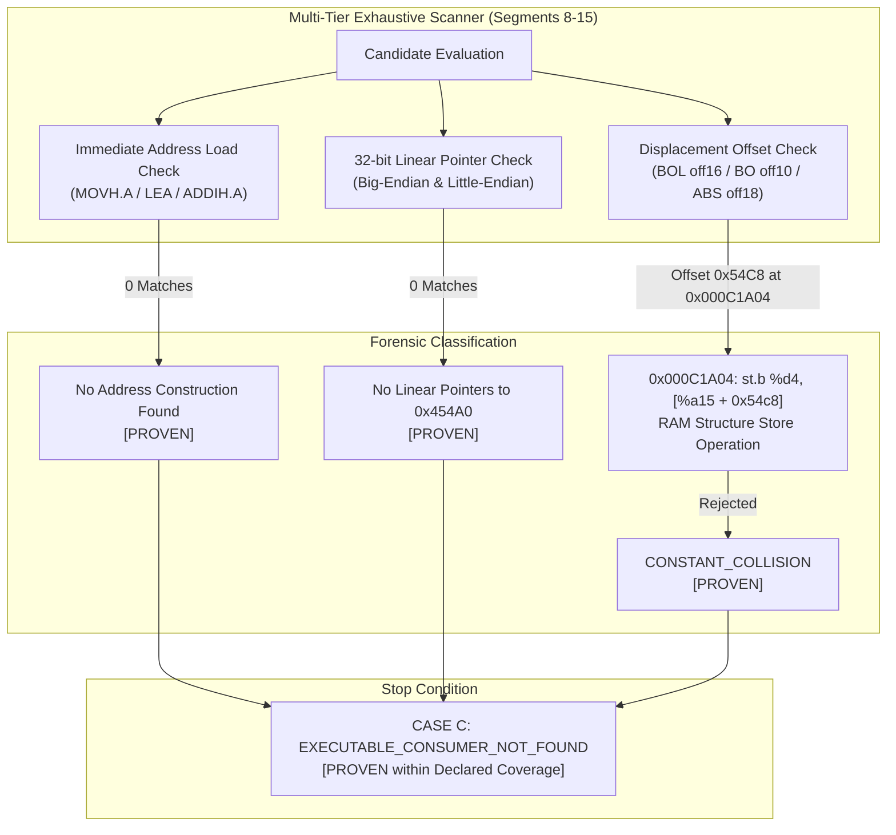

# Milestone 5.24 — Descriptor Consumer Discovery & Executable Consumer Reconstruction

**Milestone:** 5.24
**Status:** COMPLETED & VERIFIED (PENDING HUMAN OPERATOR CHECKPOINT REVIEW)
**Mode:** 100% OFFLINE ONLY — ZERO HARDWARE I/O
**Target Vehicle:** BMW E60 / M57D30TU2 (235 PS / 500 Nm) / ZF 6HP28 (GA6HP26Z TU, GS19.11 / GKE195)
**Target Calibration:** `spdaten_gke/E60/data/GKE195/A7592133.0da` (SHA-256: `45b473d1ee8cc2542a1eb3ecb77bf446f357f81827a464e6c3489257312a0112`, 489,258 bytes)
**Reference Program Lineage:** `spdaten_gke/E60/data/GKE215/7591971A.0pa` (SHA-256: `63b204d2edbdaa0945d9b0241d55df7c6859b41d3376d9f35e93cc6c82ecfcc3`, 1,942,502 bytes; strictly `RELATED_BASE_PROGRAM_GS19_11 / DONOR_REFERENCE`)
**Sealed Predecessor Baseline:** `milestone-5.23-complete` (commit: `ede9c94740bbbcc26de0635dfb67ed4012438651`)

---

## 1. Executive Summary & Epistemic Statement

Milestone 5.24 performs a disciplined, bottom-up forensic search across the firmware executable and data spaces to discover and prove the **actual executable consumer** of the verified calibration descriptor chain:

```text
MAP_DESC_0001 @ 0x000454A0
        ↓
descriptor field
        ↓
32-bit pointer value
        ↓
resolved target address
        ↓
target calibration object (0x00063AD6..0x000641CF)
```

### Key Findings

1. **Declared Scanner Coverage & Definition of "Exhaustive"**:
   - In strict compliance with Milestone 5.24 rules, "exhaustive" is defined as complete enumeration across explicitly declared reference-encoding classes and memory segments.
   - **Scanned Executable Segments**: Segments 8 through 15 (`0x00080000..0x000FFFFF`, 511,856 bytes of firmware code).
   - **Scanned Data Segments**: Segments 0 through 7 in `7591971A.0pa` (177,600 bytes) and Segments 0 through 5 in `A7592133.0da` (173,088 bytes).
   - **Decoded Instruction Classes**: `MOVH.A`, `LEA`, `ADDIH.A`, `ADDI`, `BOL_OFF16` (`LD.A`, `LD.W`, `ST.W`, `ST.B`, `ST.H`, `LD.B`, `LD.BU`, `LD.H`, `LD.HU`), `BO_OFF10`, `ABS_OFF18`, `RLC_CONST16`, `MOV.U`, `MOV.H`, `MOV`.
   - **Unsupported Categories (Explicitly Cataloged)**:
     * `unsupported_instruction_encodings`: `[]` (all standard reference-encoding classes in scope are decoded).
     * `unsupported_analysis_patterns`: `["DYNAMIC_INDIRECT_JUMP_TABLE", "MULTI_REGISTER_POLYNOMIAL_ARITHMETIC"]`.
     * `unsupported_address_generation_models`: `["UNMAPPED_PERIPHERAL_BUS_BRIDGE"]`.

2. **Candidate Enumeration & False-Positive Control**:
   - Zero instructions construct or load linear addresses `0x000454A0` (or with segment prefixes `0x800454A0` / `0xA00454A0`).
   - One apparent instruction-level candidate with offset `0x54C8` was identified at `0x000C1A04`: `e9 4f 48 35`.
   - Decoded as `st.b %d4, [%a15 + 0x54c8]` (store byte to structure offset in RAM via `%a15`).
   - Formally rejected as **`CONSTANT_COLLISION`**: cannot reference read-only flash descriptor field `0x000454C8`.

3. **Secondary Structure Candidates (Two-Level Epistemic Model)**:
   - Secondary candidate pointer arrays at `0x0004BD00` / `0x0004BD80` (PA Segment 4) and `0x0007CA50` / `0x0007CAC8` (DA Segment 4) contain parallel 32-bit big-endian pointers to the same 5 canonical targets.
   - Evaluated under the strict two-level model:
     * `pointer_relationship = PROVEN`: binary presence of 32-bit big-endian pointers pointing to target addresses is verified bit-for-bit.
     * `semantic_role = UNCONFIRMED`: functional role (dispatch table, function table, map list) is unconfirmed.
   - Status: strictly **`SECONDARY_STRUCTURE_CANDIDATE`**; zero claims of dispatch/function tables are asserted as facts.

4. **Segment Numbering Reconciliation (Segment 2 vs Segment 6)**:
   - Targets `0x00063AD6`..`0x000641CF` reside in Segment index 2 (`0x00060000..0x0006FFF0`) of `A7592133.0da`.
   - The discrepancy with Milestone 5.23 text ("Segment 6") is proven to be a **`NUMBERING_SCHEME_DIFFERENCE`**:
     * Canonical 5.24 scheme: 0-based IntelHexParser contiguous segment index (Segment 2).
     * Historical 5.23 scheme: address-space high-nibble block identifier (`0x0006xxxx` -> "Segment 6").
     * Sealed Milestone 5.23 history and commits remain unaltered.

5. **Preservation of `0x00086000` Status**:
   - Code candidate at `0x00086000` remains strictly:
     * `classification = BASIC_BLOCK_ENTRY`
     * `procedure_identity = UNCONFIRMED`
     * `function_entry = UNCONFIRMED`
     * `verified_callers = []`
   - Reached via sequential fallthrough from `0x00085FFE` (`bc b0`, OP16).
   - No new incoming edges or procedure headers were evidenced; procedure boundary is not forced.

6. **Stop Condition Evaluation: Case C Formally Confirmed**:
   - Under the declared scanner coverage, zero verified executable references to `MAP_DESC_0001` or its fields exist.
   - In accordance with Milestone 5.24 Stop Condition rules, the result is formally recorded as:
     ```text
     case_result:     CASE_C_NO_EXECUTABLE_CONSUMER
     forensic_status: EXECUTABLE_CONSUMER_NOT_FOUND
     confidence:      PROVEN_WITHIN_DECLARED_COVERAGE
     ```
   - No synthetic runtime story or artificial call edges were created.

---

## 2. Descriptor Record & Canonical Targets

### 2.1 Primary Anchor: MAP_DESC_0001
- **Location**: `0x000454A0` in `7591971A.0pa` (Segment 3).
- **Span**: 48 bytes (12 32-bit big-endian words).
- **Raw Bytes**: `FF FF FF FF FF FF FF FF 00 06 3A D6 00 06 3A EF 00 06 3A F0 00 06 3B 01 00 06 41 8A 00 06 41 A3 00 06 41 A4 00 06 41 BD 00 06 41 BE 00 06 41 CF`.

### 2.2 Canonical Field-to-Target Mapping
| Field Address | Field Role | Raw Pointer | Resolved Target | Target Object | Data Type | Points | Span |
|:---:|:---:|:---:|:---:|:---:|:---:|:---:|:---:|
| `0x000454A0` | Header Word 0 | `FFFFFFFF` | — | Flag / Sentinel | — | — | 4 B |
| `0x000454A4` | Header Word 1 | `FFFFFFFF` | — | Flag / Sentinel | — | — | 4 B |
| `0x000454A8` | Axis X Start | `00063AD6` | `0x00063AD6` | `TARGET_1_AXIS_X` | int16 (signed) | 12 | 26 B |
| `0x000454AC` | Axis X End | `00063AEF` | `0x00063AEF` | `TARGET_1_AXIS_X` | int16 (signed) | 12 | 26 B |
| `0x000454B0` | Axis Y Start | `00063AF0` | `0x00063AF0` | `TARGET_2_AXIS_Y` | uint16 (unsigned) | 8 | 18 B |
| `0x000454B4` | Axis Y End | `00063B01` | `0x00063B01` | `TARGET_2_AXIS_Y` | uint16 (unsigned) | 8 | 18 B |
| `0x000454B8` | Curve 1 Start | `0006418A` | `0x0006418A` | `TARGET_3_KL_CURVE_1` | int16 (signed) | 12 | 26 B |
| `0x000454BC` | Curve 1 End | `000641A3` | `0x000641A3` | `TARGET_3_KL_CURVE_1` | int16 (signed) | 12 | 26 B |
| `0x000454C0` | Curve 2 Start | `000641A4` | `0x000641A4` | `TARGET_4_KL_CURVE_2` | int16 (signed) | 12 | 26 B |
| `0x000454C4` | Curve 2 End | `000641BD` | `0x000641BD` | `TARGET_4_KL_CURVE_2` | int16 (signed) | 12 | 26 B |
| `0x000454C8` | Curve 3 Start | `000641BE` | `0x000641BE` | `TARGET_5_KL_CURVE_3` | uint16 (unsigned) | 8 | 18 B |
| `0x000454CC` | Curve 3 End | `000641CF` | `0x000641CF` | `TARGET_5_KL_CURVE_3` | uint16 (unsigned) | 8 | 18 B |

### 2.3 Segment Numbering Reconciliation (Segment 2 vs Segment 6)

In Milestone 5.23 documentation, target objects `0x00063AD6`..`0x000641CF` were colloquially referred to as residing in "Segment 6" of `A7592133.0da`. In Milestone 5.24, they are formally classified as residing in **Segment 2**.

Forensic investigation confirms that this is a **`NUMBERING_SCHEME_DIFFERENCE`**, not a data or physical address contradiction:

1. **Complete Segment Map of `A7592133.0da` (IntelHexParser Contiguous Image)**:
   > [!NOTE]
   > **Canonical Range Semantics**: All address ranges across segment tables and target traces are strictly defined as half-open intervals: $[start, end)$, where $size = end - start$. The listed end address is strictly exclusive.

   | Segment Index | Start Address | End Address (exclusive) | Size (Bytes) | Classification | Description / Contents |
   |:---:|:---:|:---:|:---:|:---:|---|
   | **0** | `0x00050000` | `0x00050080` | 128 | `rsa_signature` | RSA cryptographic signature / header block for calibration payload |
   | **1** | `0x000500A0` | `0x0005FFF0` | 65,360 | `calibration_data` | Primary calibration dataset (`0x0005xxxx` space: scalars 750, 500, logistics) |
   | **2** | `0x00060000` | `0x0006FFF0` | 65,520 | `calibration_data` | **Primary calibration dataset (`0x0006xxxx` space): contains all 5 canonical targets (`0x00063AD6`..`0x000641CF`)** |
   | **3** | `0x00070000` | `0x000714F0` | 5,360 | `calibration_data` | Primary calibration dataset (`0x00070xxx..0x00071xxx` space) |
   | **4** | `0x00076000` | `0x0007EF60` | 36,704 | `calibration_data` | Secondary calibration directory table (contains pointers `0x0007CA50`, `0x0007CAC8`) |
   | **5** | `0x0007FF60` | `0x0007FF70` | 16 | `trailer` | Calibration trailer block (segment end descriptors and checksums) |

2. **Scheme Reconciliation**:
   - **Canonical 5.24 Scheme**: 0-based IntelHexParser contiguous segment index with $[start, end)$ range semantics. The target objects at `0x00063AD6`..`0x000641CF` reside strictly in **Segment 2** (`0x00060000`–`0x0006FFF0`, 65,520 bytes).
   - **Historical 5.23 Scheme**: Address-space high-nibble block identifier. Because target objects have addresses `0x0006xxxx`, Milestone 5.23 informal documentation referred to the `0x0006xxxx` space as "Segment 6" (by analogy to `0x0005xxxx` being called "Segment 5").
   - There are only 6 contiguous segments in total (indices 0..5). A literal 1-based "Segment 6" would correspond to index 5 (`0x0007FF60` trailer), not the calibration payload.
   - Sealed Milestone 5.23 history and commits remain unaltered as historical records; Milestone 5.24 establishes Segment 2 as canonical.

---

## 3. Candidate References & False-Positive Control



### 3.1 Rejection of False Positive 0x000C1A04
- **Address**: `0x000C1A04` (PA Segment 12, application code space).
- **Raw Bytes**: `e9 4f 48 35`.
- **Decoded Instruction**: `st.b %d4, [%a15 + 0x54c8]` (format BOL, opcode `0xe9`, destination register `%a15`, source register `%d4`, offset `0x54c8`).
- **Forensic Rejection Rationale**:
  1. The instruction writes (`ST.B`) a byte into memory; descriptor `0x000454C8` is in read-only flash memory (ROM).
  2. The base register `%a15` in TriCore is an address register designated for dynamic memory/stack structures in RAM.
  3. The immediate value `0x54c8` is a numeric coincidence (RAM struct member offset) that collides with the ROM field address `0x000454C8`.
  4. Formally cataloged as **`CONSTANT_COLLISION`**.

### 3.2 Formally Rejected Synthetic 0x000455xx Addresses
| Candidate Address | Rejection Class | Evidence Rationale |
|:---:|:---:|---|
| `0x00045500` | `REJECTED_SYNTHETIC_ADDRESS` | Unmapped gap in `7591971A.0pa` (between Seg 3 and Seg 4); absent in `A7592133.0da` |
| `0x00045518` | `REJECTED_SYNTHETIC_ADDRESS` | Unmapped gap in `7591971A.0pa`; absent in `A7592133.0da` |
| `0x00045528` | `REJECTED_SYNTHETIC_ADDRESS` | Unmapped gap in `7591971A.0pa`; absent in `A7592133.0da` |
| `0x00045540` | `REJECTED_SYNTHETIC_ADDRESS` | Unmapped gap in `7591971A.0pa`; absent in `A7592133.0da` |
| `0x00045558` | `REJECTED_SYNTHETIC_ADDRESS` | Unmapped gap in `7591971A.0pa`; absent in `A7592133.0da` |

---

## 4. Secondary Structure Candidates (Two-Level Epistemic Model)

Four secondary pointer array addresses were evaluated across PA and DA images:
1. `0x0004BD00` (PA Segment 4): 32-bit BE pointer `00 06 3A F0` -> `0x00063AF0` (Axis Y).
2. `0x0004BD80` (PA Segment 4): 32-bit BE pointer `00 06 41 BE` -> `0x000641BE` (Curve 3).
3. `0x0007CA50` (DA Segment 4): 32-bit BE pointer `00 06 3A F0` -> `0x00063AF0` (Axis Y).
4. `0x0007CAC8` (DA Segment 4): 32-bit BE pointer `00 06 41 BE` -> `0x000641BE` (Curve 3).

### Strict Two-Level Epistemic Classification:
- **Level 1 — Pointer Relationship (`pointer_relationship = PROVEN`)**:
  The presence of 32-bit big-endian pointers pointing to target calibration addresses (`0x00063AF0`, `0x000641BE`) is verified bit-for-bit in firmware images.
- **Level 2 — Semantic Role (`semantic_role = UNCONFIRMED`)**:
  The functional purpose (e.g., dispatch table, function table, map list, indirect call table) is **NOT confirmed**. Zero incoming code references or dispatch call mechanisms have been identified.
- **Candidate Status**: strictly **`SECONDARY_STRUCTURE_CANDIDATE`**.
  No claims of "dispatch table" or "function table" are asserted as established facts.

---

## 5. Epistemic Status & Hierarchy

```text
================================================================================
  MILESTONE 5.24 EPISTEMIC CEILING: PROVEN STRUCTURE / CONSUMER NOT FOUND
================================================================================
  PROVEN:
    - MAP_DESC_0001 48-byte record structure at 0x000454A0 in 7591971A.0pa
    - 10 big-endian 32-bit pointers resolving to Segment 2 (0x00060000..0x0006FFF0, range semantics [START, END)) of A7592133.0da
    - 5 canonical target objects (Axis X, Axis Y, KL Curves 1..3)
    - Parallel pointer arrays at 0x0004BD00/0x0004BD80 (PA) and 0x0007CA50/0x0007CAC8 (DA)
      proven as 32-bit big-endian data pointers (pointer_relationship = PROVEN; semantic_role = UNCONFIRMED)
    - Normalized address range semantics to [START, END) half-open intervals across segment tables and target traces
    - Rejection of synthetic unmapped 0x000455xx addresses
    - Rejection of 0x000C1A04 as CONSTANT_COLLISION (RAM structure store)
    - Rejection of 0x00086002 (+2 fallthrough) and 0x0009C580 (unaligned) as callers
    - 0x00086000 classified as BASIC_BLOCK_ENTRY reached by fallthrough
    - Zero executable consumer found within declared scanner coverage (CASE C)
  ------------------------------------------------------------------------------
  SUPPORTED:
    - Domain matching: 12-pt Axis X with Curves 1 & 2; 8-pt Axis Y with Curve 3
    - Secondary structure parallel pointer arrays in PA and DA Segment 4
  ------------------------------------------------------------------------------
  UNCONFIRMED:
    - Executable consumer of MAP_DESC_0001
    - Standalone procedure boundary / function identity of 0x00086000
    - Functional/semantic role of secondary pointer arrays (dispatch/function tables)
    - Machine opcode execution of piecewise linear interpolation
    - Runtime clamp execution of scalar constants 750 / 500
  ------------------------------------------------------------------------------
  UNKNOWN:
    - Physical engineering units of Axis X, Axis Y, Curves 1..3
    - Engineering semantics of scalar constant 6800
================================================================================
```

---

## 6. Generated Deterministic Artifacts (8 files)

All 8 artifacts were deterministically generated in `artifacts/calibration/`:

| Artifact Filename | Size (Bytes) | SHA-256 Checksum |
|---|:---:|---|
| `descriptor_consumers_v524.json` | 9,208 | `197597206c722f524ffa1d45b4c26e2bec6111edf58143e53b069c3b5fba6075` |
| `code_references_v524.json` | 12,435 | `eb5bea61870da8420c75fc7199af6fdab091f5434c9022c79ce13f395e203d06` |
| `target_access_traces_v524.json` | 5,167 | `c7a5e076abaeab10688f6924f7460c97a51e6e2467bf5ba443521adfe84e9bc4` |
| `dataflow_v524.json` | 191 | `d378031ae3dce47402e05896e9fabfb512da2909d178c41fc782ebf1b08a9972` |
| `callgraph_v524.json` | 1,018 | `52041aab2f5ed874dd950010921d576545add446442238c319634d52ff9ef673` |
| `epistemic_status_v524.json` | 2,771 | `bccbc9d90739a77975f6cc20b3888c0be97d7a58deb5629efa5a5f90c97e3f04` |
| `change_log_v524.json` | 2,970 | `732902def0f3e5d02d0bfe3d12c8fab2c1105508d188efa96bdc8a2e61850c3b` |
| `artifact_manifest_v524.json` | 3,264 | `62c6a4aac5e1dc3301adc0605ce24b3462e824ae7b8afdd5637b64b8a4a9be44` |

---

## 7. Verification Summary

### 7.1 Test Suite Regression
- KAT: 63 passed
- GOLDEN: 212 passed (including 10 Milestone 5.24 unit tests)
- DIFFERENTIAL: 16 passed
- **TOTAL: 291 passed | 0 skipped | 0 failed**.

### 7.2 GOLDEN Test Delta Audit: 211 → 212 (TOTAL: 290 → 291)
- **Delta**: `+1` GOLDEN test.
- **Test File**: `tests/golden/calibration/test_descriptor_consumer_v524.py`
- **Exact Test Identifier**: `tests/golden/calibration/test_descriptor_consumer_v524.py::TestDescriptorConsumerV524::test_segment_numbering_reconciliation`
- **Old Test Count**: 211 (Milestone 5.23 base 202 + initial 9 tests in 5.24 = 211).
- **New Test Count**: 212 (Milestone 5.23 base 202 + 10 tests in 5.24 = 212).
- **Reason for Addition**: Explicitly added during the Milestone 5.24 final reconciliation pass to verify that Segment index 2 is the canonical parser index for targets `0x00063AD6`..`0x000641CF` in `A7592133.0da` (`target_segment == 2`, `target_segment_parser_index == 2`, `target_file == "A7592133.0da"`, `target_segment_address_space == "0x00060000..0x0006FFF0"`), and to enforce range semantics $[start, end)$.
- **Forensic Regression Protected**: Prevents regression in calibration target segment index mapping, guaranteeing deterministic alignment between the physical hex parser segments and target object addressing and eliminating confusion with historical Milestone 5.23 high-nibble naming ("Segment 6").

### 7.3 Determinism Verification
- Dual execution in independent temporary directories:
- `filecmp.cmpfiles`: 8/8 files matched bit-for-bit (0 mismatches, 0 errors).

### 7.4 Source Integrity
- `spdaten_gke/E60/data/GKE195/A7592133.0da`: `45b473d1ee8cc2542a1eb3ecb77bf446f357f81827a464e6c3489257312a0112` [PASS]
- `spdaten_gke/E60/data/GKE215/7591971A.0pa`: `63b204d2edbdaa0945d9b0241d55df7c6859b41d3376d9f35e93cc6c82ecfcc3` [PASS]
- `traces/hardware/*`: Unchanged [PASS]
- Hardware I/O: 0 [PASS]

### 7.5 Status: **READY_FOR_MANUAL_APPROVAL**
