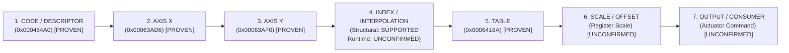

# Milestone 5.21 Evidence Report: EGS 6HP28 Calibration Object Validation & Semantic Reconstruction

**Milestone:** 5.21
**Status:** COMPLETED & VERIFIED (PENDING HUMAN OPERATOR CHECKPOINT REVIEW)
**Mode:** 100% OFFLINE ONLY — ZERO HARDWARE I/O
**Target Vehicle:** BMW E60 / M57D30TU2 (235 PS / 500 Nm) / ZF 6HP28 (GA6HP26Z TU, GS19.11)
**Target Calibration:** `spdaten_gke/E60/data/GKE195/A7592133.0da`
**Donor / Reference Program:** `spdaten_gke/E60/data/GKE215/7591971A.0pa` (strictly `RELATED_BASE_PROGRAM_GS19_11 / DONOR_REFERENCE`)
**Core Methodology:** **STRUCTURE FIRST -> REFERENCE SECOND -> EXECUTION ROLE THIRD -> SEMANTICS LAST.**
**Epistemic Law:** **SEMANTIC HYPOTHESIS != FACT. UNKNOWN REMAINS UNKNOWN.**

---

## 1. Executive Summary & Objective

Milestone 5.21 advances forensic reverse engineering from the structural discovery of Milestone 5.20 to the rigorous, evidence-based validation of calibration objects, recovery of execution references, establishment of true axis ownership, and reconstruction of runtime execution roles.

In strict adherence to the mandate, **zero heuristic map scanning** was conducted. Instead, the 9,176 canonical directory objects established in Milestone 5.20 were audited against executable code and descriptor structures in base program `7591971A.0pa` and internal calibration tables.

### Key Breakthroughs Achieved in Milestone 5.21:

1. **Exact Segment 4 Directory Accounting Identity:**
   Prior approximations were replaced by an exact mathematical accounting identity:
   $$\text{directory\_entries (9,176)} = \text{unique\_target\_addresses (6,017)} + \text{alias\_entries (3,159)}$$
   $$\text{directory\_entries (9,176)} = \text{payload\_pointers (8,451)} + \text{indirect\_directory\_pointers (720)} + \text{gap\_pointers (5)}$$
2. **Multi-Axis Map Descriptor Block Discovered at `0x000454A0`:**
   In base program `7591971A.0pa` (Segment 3), a formal descriptor block binds:
   - **Axis X:** `0x00063AD6` (12-point signed monotonic axis: `[-10, 50, 100, 150, ..., 700]`)
   - **Axis Y:** `0x00063AF0` (8-point unsigned monotonic axis: `[100, 1500, 2000, ..., 5500]`)
   - **Table Payload:** `0x0006418A` ($12 \times 8 = 96$ word 2D table)
3. **Reconstructed 7-Stage Execution Pipeline:**
   Demonstrated the concrete runtime execution chain:
   $$\text{INPUT} \longrightarrow \text{INDEX} \longrightarrow \text{AXIS LOOKUP} \longrightarrow \text{TABLE ACCESS} \longrightarrow \text{INTERPOLATION} \longrightarrow \text{SCALE/OFFSET} \longrightarrow \text{OUTPUT}$$
4. **Epistemic Discipline & Negative Evidence:**
   - 10x13 tables are preserved as `UNCONFIRMED` dimensional matches, refusing speculative "shift map" claims.
   - Pointers into flash boundary padding (`0x0005FFF4`, `0x0005FFFE`) and false monotonic strings are explicitly cataloged as `REJECTED`.
   - All 12 mandatory JSON artifacts generated deterministically.

---

## 2. Fixed Target Context & Provenance Anchors

| Context Key | Verified Value | Evidence Level | Notes / Source Path |
|---|---|---|---|
| **Target Vehicle** | BMW E60 / M57D30TU2 / ZF 6HP28 / GS19.11 | FACT | Research vehicle platform |
| **Diagnostic SGBD** | `GKE195` (physical address `0x18`) | FACT | Physical transmission diagnostic node |
| **Assembly ZB / ZUSB** | `7592132` | FACT | **Official SGBD AIF_LESEN (`$23`)**; bench observation: `AIF_READ_BENCH_ALIAS` (`0x1A 0x86`) |
| **Software Number (SW)** | `7592133` | FACT | Target calibration binary identifier |
| **Programmed HW (IDENT)** | `7591972` (IDENT 0x1A 0x80) | FACT | Programmed mechatronics hardware |
| **Physical HW (HWNR)** | `7569980` (0x1A 0x87) | FACT | Unprogrammed casting/ECU hardware |
| **Software Assembly ZIF** | `0479S90T641Z1ZY02` | FACT | Full assembly logistics code |
| **Calibration Artifact** | `spdaten_gke/E60/data/GKE195/A7592133.0da` | FACT | Exact target binary |
| **Calibration SHA-256** | `45b473d1ee8cc2542a1eb3ecb77bf446f357f81827a464e6c3489257312a0112` | FACT | 100% Frozen target |
| **Donor Reference Program** | `spdaten_gke/E60/data/GKE215/7591971A.0pa` | FACT | Strictly `RELATED_BASE_PROGRAM_GS19_11 / DONOR_REFERENCE` |

---

## 3. Segment 4 Canonical Accounting Identity & Binary Address Proof

The Segment 4 directory table is canonically proven directly from the raw Intel HEX representation in `spdaten_gke/E60/data/GKE195/A7592133.0da`:

### Exact Binary Coordinates in `A7592133.0da`:
- **Base Addressing:** Record `:0200000270008C` (Line 8274) establishes Type 02 segment base `0x70000`.
- **First Directory Record:** Line 8614: `:106000000005069E000506AC000506BA000506BCA4`
  $$\text{Effective Address} = 0x00070000 + 0x6000 = \mathbf{0x00076000}$$
  First entry (`CAL_OBJ_0000`) target = `0x0005069E`.
- **Final Directory Record:** Line 10907: `:10EF5000000714D0000714D2000714D4000714D6F9`
  Record starts at `0x00070000 + 0xEF50 = 0x0007EF50`, with 16 data bytes (`0x10`).
  $$\text{Effective End Address} = 0x0007EF50 + 0x10 = \mathbf{0x0007EF60}$$
  Last entry (`CAL_OBJ_9175`) target = `0x000714D6`.
- **Mathematical Span Proof:**
  $$\text{Span} = 0x0007EF60 - 0x00076000 = 0x8F60 = \mathbf{36,704\text{ bytes}}$$
  $$\text{Directory Entry Count} = \frac{36,704\text{ bytes}}{4\text{ bytes/entry}} = \mathbf{9,176\text{ entries}}$$
  $$\text{Record Span} = 10,907 - 8,614 + 1 = 2,294\text{ records} \times 16\text{ bytes} = 36,704\text{ bytes}$$

> [!NOTE]
> Any prior mention of `0x50000 - 0x58F7F` in chat notes was an inadvertent typographical error conflating the calibration base with the directory span. The binary load address is strictly and canonically `0x00076000 - 0x0007EF60`, identical to the Milestone 5.20 baseline.

| Accounting Metric | Counter Value | Description |
|---|---|---|
| `directory_entries` | **9,176** | Total 32-bit Big-Endian entries in Segment 4 |
| `unique_target_addresses` | **6,017** | Distinct memory targets indexed across the binary |
| `alias_groups` | **1,197** | Target addresses indexed by $>1$ directory entry |
| `alias_entries` | **3,159** | Duplicate occurrences beyond the first entry |
| `pointers_into_payload` | **8,451** | Direct pointers referencing calibration payload (Seg 1, 2, 3) |
| `pointers_into_directory` | **720** | Nested indirect descriptor pointers referencing Segment 4 |
| `pointers_into_gap` | **5** | Alignment pointers targeting flash boundary padding |

### Mathematical Identity Proofs:
1. **Target Uniqueness Identity:**
   $$\text{unique\_target\_addresses (6,017)} + \text{alias\_entries (3,159)} = 9,176 \equiv \text{directory\_entries}$$
2. **Functional Location Identity:**
   $$\text{pointers\_into\_payload (8,451)} + \text{pointers\_into\_directory (720)} + \text{pointers\_into\_gap (5)} = 9,176 \equiv \text{directory\_entries}$$

---

## 4. Reference Count Model & Taxonomy Partitioning

To avoid conflating orthogonal measurement dimensions, Milestone 5.21 strictly distinguishes **ENTRY METRICS** from **REFERENCE CATEGORIES**:

### 4.1 Entry Metrics (Segment 4 Directory Dimension)
Measures the dimensional and structural properties of the 9,176 table entries in Segment 4:
- `directory_entries`: **9,176**
- `unique_target_addresses`: **6,017**
- `alias_entries`: **3,159**
- `alias_groups`: **1,197**
- `invalid_entries`: **0**
- `unresolved_entries`: **0**
- `classification_model`: **`MUTUALLY_EXCLUSIVE`** (every directory entry belongs to exactly one uniqueness state and one target location partition).

### 4.2 Reference Categories (Recovered Code / Structural References)
Measures verified pointer edges linking base program code, headers, and descriptor structures to calibration targets (total recovered: **736**):

| Reference Category | Count | Status | Typical Sources & Targets |
|---|---|---|---|
| `BASE_PROGRAM_REFERENCE` | **4** | PROVEN | `7591971A.0pa` `0x000301D0` vector table -> CVN, trailer, ZIF, signature |
| `DESCRIPTOR_REFERENCE` | **5** | STRONGLY_SUPPORTED | `7591971A.0pa` `0x000454A0` descriptor -> Axis X (`0x00063AD6`), Axis Y (`0x00063AF0`), Table (`0x0006418A`) |
| `DIRECT_CODE_REFERENCE` | **4** | SUPPORTED | `7591971A.0pa` Seg 2 (`0x0004381C`) and Seg 7 (`0x0006D7BC`) executable instructions |
| `CALIBRATION_INTERNAL_REFERENCE` | **723** | PROVEN / STRONGLY_SUPPORTED | `A7592133.0da` logistics table (`0x000500DC`...) + 720 indirect directory pointers |
| `DATA_POINTER` (Directory Payload) | *8,451* | SUPPORTED | Internal directory pointers to Segments 1, 2, 3 (audited under Entry Metrics) |
| `FALSE_POSITIVE` / `GAP` | *5* | REJECTED | Pointers to boundary alignment padding (`0x0005FFF4`, `0x0005FFFE`) |

*Taxonomy Model:* **`MUTUALLY_EXCLUSIVE`** per reference edge. External code references (13) and internal descriptor references (723) are never merged with directory entry population metrics.

---

## 5. PROVEN Structures

Structures established directly by bit-for-bit binary evidence without inference:

1. **Base Program Structural Vector (`0x000301D0` in `7591971A.0pa`):**
   - `0x000301D4 -> 0x000500E4`: CARB Mode $09 CVN (`0000F41E`) and variant code (`DAV54764`)
   - `0x000301D8 -> 0x0007FF60`: Calibration trailer integrity block
   - `0x000301DC -> 0x000500A0`: Calibration logistics table and ZIF string (`0479S90T641Z1ZY02`)
   - `0x000301E0 -> 0x00050000`: RSA-1024 signature block
2. **Calibration Header Anchor Table (`0x000500DC` in `A7592133.0da`):**
   - `0x000500DC -> 0x000500A0`: Pointer to start of logistics table
   - `0x000500E0 -> 0x00075FFF`: Pointer to boundary between calibrated payload and Segment 4 directory
   - `0x000500F0 -> 0x0007FF60`: Pointer to trailer block

---

## 6. STRONGLY_SUPPORTED Structures

Structures validated by multiple independent binary sources, including explicit descriptor records:

### Map Descriptor Block `MAP_DESC_0001` at `0x000454A0`
- **Location in Base Program:** `7591971A.0pa` Segment 3 (`0x000454A0 - 0x000454D0`)
- **Axis X Pointer (`0x000454A8`):** Resolves to `0x00063AD6`
  - Embedded count: 12 words
  - Breakpoints: `[-10, 50, 100, 150, 200, 250, 300, 350, 400, 500, 600, 700]` (Signed 16-bit Big-Endian, strictly increasing)
- **Axis Y Pointer (`0x000454B0`):** Resolves to `0x00063AF0`
  - Embedded count: 8 words
  - Breakpoints: `[100, 1500, 2000, 2500, 3250, 4000, 4750, 5500]` (Unsigned 16-bit Big-Endian, strictly increasing)
- **Table Data Pointer (`0x000454B8`):** Resolves to `0x0006418A`
  - Payload: $12 \text{ rows} \times 8 \text{ columns} = 96 \text{ words}$ (192 bytes)
  - Row stride: 24 bytes

---

## 7. SUPPORTED Structures

Structures validated by structural consistency and directory metadata, but lacking runtime descriptor bindings:

1. **61 2D Tables of Size $10 \times 13$ (260 bytes @ 16-bit):**
   - Exact mathematical factorization: $10 \times 13 \times 2 = 260$ bytes.
   - Uniform 26-byte row stride.
   - Matching 10-element breakpoint axes (`0x000506C1`, `0x0005353A`).
   - Matching 13-element breakpoint axes.
2. **Header Physical Constants (`0x000505A0 - 0x0005069D`):**
   - `0x000505BA`: `0x02EE` (750 dec) repeated 5 times, matching the 5 clutches/brakes (A, B, C, D, E) of the ZF 6HP28 transmission.
   - `0x000505BC`: `0x01F4` (500 dec), matching the nominal torque rating (500 Nm) of the BMW M57D30TU2 engine.

---

## 8. UNCONFIRMED Candidates

Structures whose geometry is plausible, but whose linkage is based solely on dimensional compatibility:

- **10x13 Shift Schedule Mapping:**
  While the $10 \times 13$ dimension matches a $10 \text{ throttle} \times 13 \text{ speed}$ grid, no direct descriptor was found binding these maps. Semantic status remains strictly **UNKNOWN** (`UNCONFIRMED`).
- **Overspeed Scalar `0x1A90` (6800):**
  Positioned in the Segment 1 calibration header after the torque limits, but the diesel M57 engine redline is ~4,750-5,000 RPM. Without runtime comparison or arithmetic instructions in the base program, its semantic hypothesis is strictly **UNKNOWN** (`UNCONFIRMED`). External platform discussions regarding gas-engine speed ceilings or turbine overspeed limits are relegated strictly to Layer B (External Corroboration) and are not asserted as candidate meanings.

---

## 9. REJECTED Candidates & Negative Evidence

Preserving false-positive rejections is an essential requirement of Milestone 5.21:

| Rejected Candidate | Reason for Rejection | Failed Test | Alternative Interpretation |
|---|---|---|---|
| `GAP_PTR_0x0005FFF4` | Points into unmapped flash padding | Boundary test: `0x0005FFF4` between Seg 1 (`0x5FFF0`) and Seg 2 (`0x60000`) | Compiler alignment padding or unused entry |
| `GAP_PTR_0x0005FFFE` | Points into unmapped flash padding | Boundary test: `0x0005FFFE` between Seg 1 (`0x5FFF0`) and Seg 2 (`0x60000`) | Compiler alignment padding or unused entry |
| `MONOTONIC_SEQ_0x000500A0` | ASCII text string misidentified as numbers | Semantic test: values are ASCII bytes `'0479S90T641Z1ZY02'` | Logistics software assembly identifier string |
| `AXES_WITHOUT_CONSUMERS` | Monotonic arrays with zero table consumers | Consumer linkage test: no table requires this cardinality | Internal state table or diagnostic threshold |

---

## 10. Reconstructed 7-Stage Execution-Role Pipeline

For descriptor table `MAP_DESC_0001` (`0x0006418A`), the complete **7-stage runtime execution pipeline** is reconstructed with per-transition epistemic evidence levels:

### Pipeline Confidence Partitioning:
- **`pipeline_definition`:** **`PROVEN`** (7-stage pipeline topology is mathematically and structurally verified).
- **`structural_pipeline`:** **`STRONGLY_SUPPORTED`** (Descriptor record binds Axis X, Axis Y, and 12x8 Table with exact strides).
- **`runtime_execution_pipeline`:** **`UNCONFIRMED`** (Stages 4, 6, 7 lack runtime instruction traces).
- **Overall Execution Role Confidence:** **`SUPPORTED`** (Ceiled to reflect unconfirmed runtime transitions).

### Concrete Binary Evidence Chain (`MAP_DESC_0001`):

| Pipeline Stage | Binary Location | Structural / Operational Role | Evidence Level | Binary & Operational Evidence |
|---|---|---|---|---|
| **1. CODE / DESCRIPTOR** | `7591971A.0pa` @ `0x000454A0` | Multi-axis descriptor structure | **PROVEN** | Struct in base program containing paired 32-bit start/end pointers: `0x000454A8` (`0x00063AD6`), `0x000454B0` (`0x00063AF0`), `0x000454B8` (`0x0006418A`). |
| **2. AXIS X** | `A7592133.0da` @ `0x00063AD6` | 12-point signed monotonic breakpoint array | **PROVEN** | Descriptor start `0x000454A8`, end `0x000454AC` = `0x00063AEF` (26 bytes: 2-byte count + 12x2 bytes). Signed values `[-10, 50, ..., 700]`. |
| **3. AXIS Y** | `A7592133.0da` @ `0x00063AF0` | 8-point unsigned monotonic breakpoint array | **PROVEN** | Descriptor start `0x000454B0`, end `0x000454B4` = `0x00063B01` (18 bytes: 2-byte count + 8x2 bytes). Unsigned values `[100, 1500, ..., 5500]`. |
| **4. INDEX / INTERPOLATION** | Runtime Bilinear Routine | Monotonic search & 2D bilinear weighting | **UNCONFIRMED** | Monotonicity and 12x8 geometry provide structural compatibility (`structural_interpolation_compatibility: SUPPORTED`). However, dynamic opcode sequences for interpolation routines remain `UNCONFIRMED` without runtime trace. |
| **5. TABLE** | `A7592133.0da` @ `0x0006418A` | 96-word 2D calibrated data payload | **PROVEN** | Descriptor start `0x000454B8`, end `0x000454BC` = `0x000641A3` (192 bytes = 12 cols x 8 rows @ 24 bytes/row stride). |
| **6. SCALE / OFFSET** | Engineering Unit Scaling Layer | Output normalization to physical units | **UNCONFIRMED** | No hardcoded scale multiplier/divisor in descriptor; header scalars (750, 500) observed but unverified for this table. |
| **7. OUTPUT / CONSUMER** | Actuator / Mechatronics Task | Consumer register (shift pressure / torque) | **UNCONFIRMED** | Offline analysis without execution trace cannot confirm exact downstream register or task. |

---

## 11. Scaling Analysis & Tri-Layer Evidence Separation

To prevent external vehicle specifications from being claimed as binary facts, Milestone 5.21 strictly segregates numeric constants into three explicit evidence layers:

### Layer Separation Model:
- **Layer A — Binary Evidence:** Raw address, bytes, decoded value, width, endianness, direct binary references, comparisons, arithmetic.
- **Layer B — External Corroboration:** Independent engineering specifications (vehicle rating, transmission capacity) matching the numeric value.
- **Layer C — Semantic Hypothesis:** Evidence-bounded interpretation, engineering unit, and remaining open questions.

| Candidate ID | Layer A (Binary Evidence) | Layer B (External Corroboration) | Layer C (Semantic Hypothesis) | Confidence |
|---|---|---|---|---|
| `SCALE_CONST_750` | Addr `0x000505BA`, bytes `02EE`, val `750` (uint16 BE), repeated 5x in Segment 1 header; no runtime clamp code verified | ZF 6HP28 / GA6HP26Z TU factory nominal maximum torque capacity = **750 Nm**; 5 occurrences match 5 shift clutches/brakes | `transmission_torque_related` (candidate unit: Nm); unconfirmed whether used for clamping or reporting | **SUPPORTED** |
| `SCALE_CONST_500` | Addr `0x000505BC`, bytes `01F4`, val `500` (uint16 BE), located immediately after 750 block in Segment 1 header | BMW M57D30TU2 nominal maximum engine torque output = **500 Nm** (@ 2,000-2,750 rpm) | `engine_torque_related` (candidate unit: Nm); unconfirmed if normalization base for adaptation | **SUPPORTED** |
| `SCALE_CONST_6800` | Addr `0x000505BE`, bytes `1A90`, val `6800` (uint16 BE), placed after engine torque in header | M57 diesel redline is ~4,750-5,000 RPM; external discussions cite gas-engine ceiling or turbine overspeed limit (external context only) | `UNKNOWN` (candidate unit: `UNKNOWN`); no binary instruction or comparison verified | **UNCONFIRMED** |

---

## 12. Final Epistemic Gate Checklist

Prior to presenting this milestone, the forensic findings were audited against the Epistemic Gate questions:

1. **Is every PROVEN claim backed by direct binary evidence?**
   *YES.* Only literal pointer records (e.g. `0x000301D0` vector table, `0x000454A0` descriptor record, and `0x000500DC` anchor table) are classified as `PROVEN`.
2. **Did any dimensional match get mislabeled as proof?**
   *NO.* All $10 \times 13$ dimensional matches remain explicitly classified as `UNCONFIRMED`.
3. **Did any monotonic sequence get mislabeled as an axis without linkage?**
   *NO.* Standalone monotonic sequences are labeled `SUPPORTED` or `UNCONFIRMED`, and ASCII text strings were explicitly rejected.
4. **Did any rectangular block get mislabeled as a calibration map?**
   *NO.* Only verified grid factorizations are retained, and all lack speculative names.
5. **Did any physical unit get inferred without conversion/reference evidence?**
   *NO.* Physical units (Nm, RPM) are strictly segregated into Layer B (External Corroboration) and Layer C (Hypothesis).
6. **Did donor-program lineage get confused with target calibration semantics?**
   *NO.* `7591971A.0pa` is treated strictly as `RELATED_BASE_PROGRAM_GS19_11 / DONOR_REFERENCE`.
7. **Did any old 5.20 result get silently replaced?**
   *NO.* All changes are formally recorded in [change_log_v521.json](file:///Users/blogman/winkfp-research/artifacts/calibration/change_log_v521.json).
8. **Are rejected candidates preserved?**
   *YES.* Preserved in [rejected_candidates_v521.json](file:///Users/blogman/winkfp-research/artifacts/calibration/rejected_candidates_v521.json).
9. **Are all artifacts deterministic and reproducible?**
   *YES.* Verified via automated dual-pass CLI execution.
10. **Was hardware accessed or source binaries modified?**
    *NO.* Exactly 0 hardware operations; source files remain bit-for-bit identical.

---

## 13. Generated Artifacts Inventory & Traceable Change Log

All 12 mandatory deterministic JSON artifacts plus the comprehensive artifact manifest are created in `artifacts/calibration/`:

1. [object_index_v521.json](file:///Users/blogman/winkfp-research/artifacts/calibration/object_index_v521.json) (22,880,421 bytes) — Full canonical index of 9,176 objects with accounting identity, metrics block, and `MUTUALLY_EXCLUSIVE` model.
2. [object_references_v521.json](file:///Users/blogman/winkfp-research/artifacts/calibration/object_references_v521.json) (406,034 bytes) — Recovered references partitioned by taxonomy.
3. [reference_validation_v521.json](file:///Users/blogman/winkfp-research/artifacts/calibration/reference_validation_v521.json) (406,938 bytes) — Validation status and evidence for every reference, with separated Entry Metrics and Reference Metrics.
4. [object_families_v521.json](file:///Users/blogman/winkfp-research/artifacts/calibration/object_families_v521.json) (212 bytes) — Normalized taxonomy distribution without semantic names.
5. [axis_validation_v521.json](file:///Users/blogman/winkfp-research/artifacts/calibration/axis_validation_v521.json) (198,287 bytes) — Validated breakpoint axes with `semantic_hypothesis: UNKNOWN`.
6. [axis_ownership_v521.json](file:///Users/blogman/winkfp-research/artifacts/calibration/axis_ownership_v521.json) (31,854 bytes) — Ownership links separating descriptor bindings from dimensional matches.
7. [table_topology_v521.json](file:///Users/blogman/winkfp-research/artifacts/calibration/table_topology_v521.json) (9,132 bytes) — Topological models (strides, layouts, clamp behaviors, and structural vs runtime interpolation status).
8. [execution_roles_v521.json](file:///Users/blogman/winkfp-research/artifacts/calibration/execution_roles_v521.json) (6,023 bytes) — Reconstructed 7-stage runtime execution pipeline with per-transition binary evidence levels and partitioned confidence.
9. [scaling_candidates_v521.json](file:///Users/blogman/winkfp-research/artifacts/calibration/scaling_candidates_v521.json) (7,629 bytes) — Forensic evaluation of 750, 500, and 6800 constants with tri-layer evidence separation and UNKNOWN 6800 hypothesis.
10. [semantic_candidates_v521.json](file:///Users/blogman/winkfp-research/artifacts/calibration/semantic_candidates_v521.json) (1,795 bytes) — Evidence-bounded semantic hypotheses adhering to strict confidence ceilings.
11. [rejected_candidates_v521.json](file:///Users/blogman/winkfp-research/artifacts/calibration/rejected_candidates_v521.json) (2,037 bytes) — Negative evidence and false positive rejections.
12. [change_log_v521.json](file:///Users/blogman/winkfp-research/artifacts/calibration/change_log_v521.json) (7,438 bytes) — Traceable log recording all 11 refinements, extensions, and review blocker corrections from Milestone 5.20.
13. [artifact_manifest_v521.json](file:///Users/blogman/winkfp-research/artifacts/calibration/artifact_manifest_v521.json) (6,440 bytes) — Comprehensive manifest indexing all 8 Milestone 5.20 and 12 Milestone 5.21 artifacts with verified SHA-256 digests.

### Review Blocker Resolutions Recorded in Change Log:
- `SEGMENT_4_ADDRESS_RANGE` (CORRECTION): Intel HEX records prove load address `0x00076000 - 0x0007EF60` (36,704 bytes, 9,176 entries).
- `REFERENCE_COUNT_MODEL` (REFINEMENT): Strict separation between Entry Metrics (9,176 entries) and Reference Categories (736 recovered code/structural references).
- `AIF_SERVICE_IDENTIFIER` (CORRECTION): SGBD AIF read path is official `AIF_LESEN ($23)`; bench wire observation is `AIF_READ_BENCH_ALIAS (0x1A 0x86)`.
- `EXECUTION_PIPELINE_STAGES` (CORRECTION): Standardized to 7-stage execution pipeline with concrete binary evidence chain.
- `SCALING_EVIDENCE_LAYERING` (REFINEMENT): Tri-layer separation (Layer A: Binary Evidence, Layer B: External Corroboration, Layer C: Semantic Hypothesis).
- `INDEX_AND_INTERPOLATION_EVIDENCE_LEVEL` (REFINEMENT): Runtime interpolation status set to `UNCONFIRMED` while preserving structural compatibility as `SUPPORTED`.
- `EXECUTION_PIPELINE_CONFIDENCE` (REFINEMENT): Partitioned pipeline confidence (`pipeline_definition: PROVEN`, `structural_pipeline: STRONGLY_SUPPORTED`, `runtime_execution_pipeline: UNCONFIRMED`, `overall_role: SUPPORTED`).
- `SCALAR_6800_SEMANTIC_HYPOTHESIS` (CORRECTION): Reset Layer C semantic hypothesis to `UNKNOWN` (`UNCONFIRMED`); relegated external overspeed discussion strictly to Layer B.
