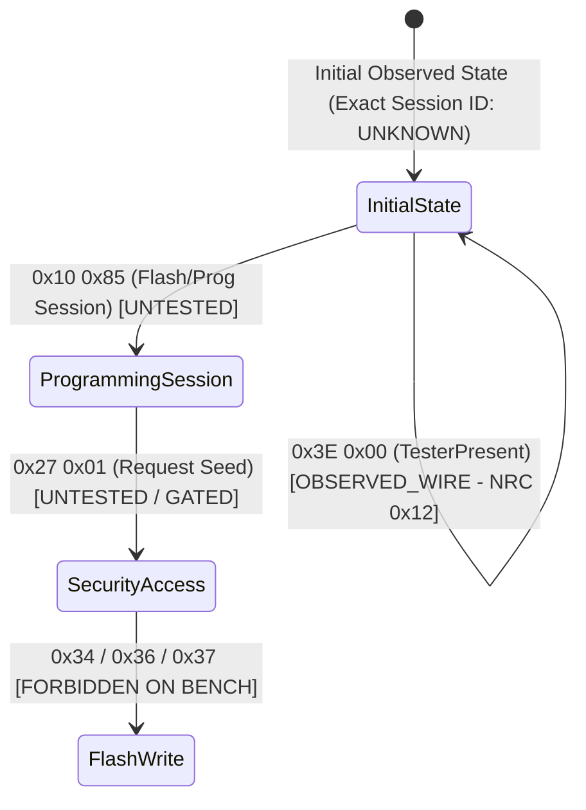

# Milestone 1.1: Repeatable Physical Diagnostic Validation & Evidence Report

## 1. Executive Summary

* **Milestone**: Milestone 1.1 — Repeatable Physical Diagnostic Validation.
* **Target Hardware**: Physical BMW ZF 6HP EGS (Electronic Transmission Control / Mechatronic) on bench.
* **Target Diagnostic Address**: `0x18` (Tester source address: `0xF1`).
* **Transport**: Direct K+DCAN serial interface on macOS (`/dev/cu.usbserial-A50285BI`, FTDI FT232R, 115200 8N1).
* **Validation Outcome**: **PASSED (100% Deterministic Wire Repeatability)** across three independent consecutive physical probe sessions.
* **Scope Disclaimer**: This milestone validates physical transport and low-level diagnostic communication over K+DCAN. It does **NOT** validate WinKFP flash reprogramming, erase routines, block downloads, or signature verification.

---

## 2. Hardware & Bench Environment

| Parameter | Value | Details |
|---|---|---|
| **Host System** | macOS Darwin 24.x (x86_64) | Development workstation running Python 3.14 (.venv) |
| **Interface Hardware** | K+DCAN USB OBD Cable | Genuine FTDI FT232R USB-to-UART bridge (VID:PID `0403:6001`) |
| **Device Node** | `/dev/cu.usbserial-A50285BI` | macOS callout device node with hardware flow control disabled |
| **Baud Rate / Framing** | 115,200 baud, 8N1 | 8 data bits, no parity, 1 stop bit; DS2/BMW-FAST framing |
| **Target ECU** | ZF 6HP EGS Mechatronic | Diagnostic address `0x18`, diagnostic bus K+DCAN |
| **Tester Address** | `0xF1` | Standard diagnostic tester ID |
| **Safety Interlocks** | Flash write / erase hard-blocked; SecurityAccess (`0x27`) gated; fail-closed unmapped jobs |

---

## 3. Consecutive Physical Probe Traces (3-Run Repeatability)

The diagnostic probe script (`tools/kdcan_probe.py`) was executed three consecutive times against the live ZF 6HP ECU with bus closing and reopening between sessions.

### Run 1 Trace (`logs/kdcan_m1_1_run1.log`)
* **Session Start**: `2026-09-26T10:51:50.037559`
* **Transaction 1 (TesterPresent)**:
  * **TX**: `82 18 F1 3E 00 C9` (`3E 00`)
  * **RX**: `83 F1 18 7F 3E 12 5B` (`7F 3E 12`, RTT = 34.7 ms)
* **Transaction 2 (ReadECUIdentification - AIF)**:
  * **TX**: `82 18 F1 1A 86 2B` (`1A 86`)
  * **RX**: `80 F1 18 42 5A 86 40 43 53 36 38 32 39 34 20 08 12 04 00 00 07 59 21 32 00 00 07 59 21 33 00 00 00 00 00 00 00 02 40 4E 46 53 30 31 00 30 34 37 39 53 39 30 54 36 34 31 5A 57 42 41 4E 58 37 31 30 34 30 FF FF FF 0F` (66 payload bytes, 71 total bytes, RTT = 102.1 ms)

### Run 2 Trace (`logs/kdcan_m1_1_run2.log`)
* **Session Start**: `2026-09-26T10:51:57.618914` (+7.58 s)
* **Transaction 1 (TesterPresent)**:
  * **TX**: `82 18 F1 3E 00 C9` (`3E 00`)
  * **RX**: `83 F1 18 7F 3E 12 5B` (`7F 3E 12`, RTT = 34.6 ms)
* **Transaction 2 (ReadECUIdentification - AIF)**:
  * **TX**: `82 18 F1 1A 86 2B` (`1A 86`)
  * **RX**: `80 F1 18 42 5A 86 40 43 53 36 38 32 39 34 20 08 12 04 00 00 07 59 21 32 00 00 07 59 21 33 00 00 00 00 00 00 00 02 40 4E 46 53 30 31 00 30 34 37 39 53 39 30 54 36 34 31 5A 57 42 41 4E 58 37 31 30 34 30 FF FF FF 0F` (66 payload bytes, 71 total bytes, RTT = 111.7 ms)

### Run 3 Trace (`logs/kdcan_m1_1_run3.log`)
* **Session Start**: `2026-09-26T10:52:05.361842` (+7.74 s)
* **Transaction 1 (TesterPresent)**:
  * **TX**: `82 18 F1 3E 00 C9` (`3E 00`)
  * **RX**: `83 F1 18 7F 3E 12 5B` (`7F 3E 12`, RTT = 38.2 ms)
* **Transaction 2 (ReadECUIdentification - AIF)**:
  * **TX**: `82 18 F1 1A 86 2B` (`1A 86`)
  * **RX**: `80 F1 18 42 5A 86 40 43 53 36 38 32 39 34 20 08 12 04 00 00 07 59 21 32 00 00 07 59 21 33 00 00 00 00 00 00 00 02 40 4E 46 53 30 31 00 30 34 37 39 53 39 30 54 36 34 31 5A 57 42 41 4E 58 37 31 30 34 30 FF FF FF 0F` (66 payload bytes, 71 total bytes, RTT = 100.1 ms)

---

## 4. Repeatability & Wire Stability Analysis

### 4.1 Wire Byte Repeatability Matrix

| Frame | Parameter | Run 1 | Run 2 | Run 3 | Repeatability |
|---|---|---|---|---|---|
| **TesterPresent TX** | Raw Wire Bytes | `82 18 F1 3E 00 C9` | `82 18 F1 3E 00 C9` | `82 18 F1 3E 00 C9` | **100% Byte-Exact** |
| **TesterPresent RX** | Raw Wire Bytes | `83 F1 18 7F 3E 12 5B` | `83 F1 18 7F 3E 12 5B` | `83 F1 18 7F 3E 12 5B` | **100% Byte-Exact** |
| **AIF Query TX** | Raw Wire Bytes | `82 18 F1 1A 86 2B` | `82 18 F1 1A 86 2B` | `82 18 F1 1A 86 2B` | **100% Byte-Exact** |
| **AIF Response RX** | Raw Wire Bytes (71 B) | `80 F1 18 42 5A 86...0F` | `80 F1 18 42 5A 86...0F` | `80 F1 18 42 5A 86...0F` | **100% Byte-Exact** |

Across all three independent executions, **every single transmitted and received byte matched identically**, confirming byte-for-byte deterministic wire responses across the three observed runs.

### 4.2 Timing Jitter & Latency Analysis

| Transaction | Run 1 RTT | Run 2 RTT | Run 3 RTT | Mean RTT | Jitter Spread ($\Delta$) |
|---|---|---|---|---|---|
| **TesterPresent (`3E 00`)** | 34.7 ms | 34.6 ms | 38.2 ms | 35.8 ms | 3.6 ms |
| **AIF Query (`1A 86`)** | 102.1 ms | 111.7 ms | 100.1 ms | 104.6 ms | 11.6 ms |

#### Explanation of Timing Variations:
1. **Deterministic Wire vs. Non-Deterministic Transport**:
   * The DS2/KWP2000 payload is 100% deterministic at the byte level.
   * Round-trip timing (RTT) exhibits minor jitter ($\pm 1.8$ ms for short frames, $\pm 5.8$ ms for long 71-byte frames).
2. **Sources of Jitter**:
   * **FTDI USB Latency Timer**: The FT232R USB-serial chip defaults to a 16 ms latency timer before flushing partial buffers to the USB host.
   * **macOS Serial Stack & Scheduling**: Non-real-time OS thread scheduling introduces 1–5 ms variations when servicing USB bulk IN transfers.
   * **Physical Line Transmission Time**: At 115,200 baud (10 bits per byte including start/stop bits):
     * 6-byte TX: $6 \times (10 / 115200) \approx 0.52$ ms.
     * 71-byte RX: $71 \times (10 / 115200) \approx 6.16$ ms.
     * The remaining 90–100 ms reflects ECU internal EEPROM read time and message dispatch latency.

---

## 5. Diagnostic Session State Investigation

### 5.1 Initial Diagnostic State Analysis
* **Observed Behavior**: The physical ECU answered `0x1A 0x86` with full AIF identity data **immediately upon connection from the initial ECU state observed at the start of each probe session**, without requiring any preceding `0x10` (`StartDiagnosticSession`) request.
* **Exact Diagnostic Session Identifier**: **UNKNOWN**. Whether this initial observed state corresponds to standard KWP2000 Default Diagnostic Session (`0x81`), ISO standard default (`0x01`), or an ECU-specific internal state cannot be proven without explicit session interrogation or mode switching. The evidence establishes strictly that `0x1A 0x86` is accepted from the observed initial diagnostic state.
* **Significance**: Low-level read identification on physical wire does not require a prior session change command.

### 5.2 Negative Response Code Analysis (`0x7F 0x3E 0x12`)
* When sent `3E 00` (TesterPresent with subfunction parameter `0x00`), the physical ECU responded on wire with `83 F1 18 7F 3E 12 5B` (RTT = 34.6–38.2 ms).
* **Byte Breakdown**:
  * `0x7F`: KWP2000 Negative Response Service ID.
  * `0x3E`: Rejected Service ID (`TesterPresent`).
  * `0x12`: Negative Response Code (`NRC_SUBFUNCTION_NOT_SUPPORTED` / `subFunctionNotSupportedInvalidFormat`).
* **Direct Evidence Scope**:
  * The physical wire trace directly proves that the ECU acknowledged and responded to service `0x3E` with KWP negative response `0x7F 0x3E 0x12`.
  * This confirms physical ECU presence and wire-level response handling for service `0x3E`.
  * It must **NOT** be interpreted as broader proof of parser health, parser robustness, or full protocol compliance beyond the observed negative response.

### 5.3 Diagnostic Session Hierarchy

---

## 6. Job Mapping Audit & Two-Dimensional Evidence Taxonomy

To strictly separate physical wire observations from high-level EDIABAS / SGBD job semantics, all diagnostic interactions are evaluated across two independent evidence dimensions:

1. **`OBSERVED_WIRE`**: A specific byte sequence was physically transmitted and received on the physical K+DCAN wire.
2. **`OBSERVED_JOB_MAPPING`**: A high-level EDIABAS / SGBD / WinKFP job name is confirmed to map to a specific wire telegram via direct execution evidence (e.g. SGBD bytecode execution or factory EDIABAS trace correlation for this ECU).

The three direct probe runs establish **`OBSERVED_WIRE` ONLY**. Direct SGBD execution traces for this specific transmission controller were not captured during this milestone; therefore, all job mappings remain `INFERRED_JOB_MAPPING` or `UNKNOWN`.

### Two-Dimensional Evidence Matrix

| Diagnostic Operation / Job Name | Raw Wire Telegram | `OBSERVED_WIRE` | `OBSERVED_JOB_MAPPING` | Final Classification | DirectKdcanBus Handling |
|---|---|---|---|---|---|
| **Wire: AIF Identification Query** | `0x1A 0x86` | **YES** (3/3 runs, 66 B) | N/A (low-level wire service) | **OBSERVED_WIRE** | Executed via `wire_read_aif()` or `transport.send_job()`. |
| **Wire: TesterPresent** | `0x3E 0x00` | **YES** (3/3 runs, `7F 3E 12`) | N/A (low-level wire service) | **OBSERVED_WIRE** | Executed via `wire_tester_present()` or `transport.send_job()`. |
| `AIF_LESEN` | Inferred to `0x1A 0x86` | **YES** (wire verified) | **NO** (unverified SGBD mapping on ECU) | **INFERRED_JOB_MAPPING** | **FAIL-CLOSED** by default (`NotImplementedError`); allowed only with `allow_inferred=True`. |
| `TESTER_PRESENT` | Inferred to `0x3E 0x00` | **YES** (wire verified) | **NO** (unverified SGBD mapping on ECU) | **INFERRED_JOB_MAPPING** | **FAIL-CLOSED** by default (`NotImplementedError`); allowed only with `allow_inferred=True`. |
| `IDENT_LESEN` | Inferred to `0x1A 0x86` / `0x1A 0x80` | **YES** (via `1A 86`) | **NO** (unverified SGBD mapping on ECU) | **INFERRED_JOB_MAPPING** | **FAIL-CLOSED** by default (`NotImplementedError`); allowed only with `allow_inferred=True`. |
| `SG_PHYS_HWNR_LESEN` | Inferred to extract ZB from `0x1A 0x86` | **YES** (via `1A 86`) | **NO** (unverified SGBD mapping on ECU) | **INFERRED_JOB_MAPPING** | **FAIL-CLOSED** by default (`NotImplementedError`); allowed only with `allow_inferred=True`. |
| `SG_STATUS_LESEN` | Speculatively assumed `0x3E 0x00` | **NO** | **NO** (zero trace / SGBD evidence) | **UNKNOWN** | **FAIL-CLOSED ALWAYS** (`NotImplementedError` even if `allow_inferred=True`). |
| `AUTHENTISIERUNG` | KWP2000 ReadAuthCapabilities | **NO** | **NO** | **INFERRED** | **FAIL-CLOSED** (`NotImplementedError`). |
| `AUTHENTISIERUNG_ZUFALLSZAHL_LESEN` | `0x27 0x01` / `0x03` / `0x05` (Seed) | **NO** | **NO** | **INFERRED** | **FAIL-CLOSED** (`NotImplementedError`). |
| `NG_AUTHENTISIERUNG_START` | `0x27 0x02` / `0x04` / `0x06` (Key) | **NO** | **NO** | **INFERRED** | **FAIL-CLOSED** (`NotImplementedError`). |
| `SERIENNUMMER_LESEN` | `0x1A 0x90` / `0x21` serial record | **NO** | **NO** | **INFERRED** | **FAIL-CLOSED** (`NotImplementedError`). |
| `FLASH_PARAMETER_SETZEN` | Session / Baud / Block size negotiation | **NO** | **NO** | **UNKNOWN** | **FAIL-CLOSED** (`NotImplementedError`). |
| `INIT_VDLE` | WinKFP VDLE virtual dispatcher callback | N/A (virtual) | N/A (virtual) | **VIRTUAL** | **FAIL-CLOSED** (`NotImplementedError`). |
| `FLASH_SCHREIBEN` | Flash Block Write Transfer (`0x36`) | Prohibited | Prohibited | **FORBIDDEN** | Hard Block (`KdcanError`). |
| `FLASH_SCHREIBEN_XXL` | High-speed Flash Block Write | Prohibited | Prohibited | **FORBIDDEN** | Hard Block (`KdcanError`). |
| `SEND_SEGMENT` | VDLE segment download iteration | Prohibited | Prohibited | **FORBIDDEN** | Hard Block (`KdcanError`). |
| `NG_SIGNATUR_PRUEFEN` | Signature verification / checksum job | Prohibited | Prohibited | **FORBIDDEN** | Hard Block (`KdcanError`). |

---

## 7. Sanitized Physical ECU Identification

The 66-byte AIF payload returned by the physical ZF 6HP EGS mechatronic decoded to the following parameters:

| Parameter | Decoded Value | Significance |
|---|---|---|
| **Short VIN** | `CS68294` | Standard BMW 7-character vehicle identifier |
| **Chassis VIN** | `WBANX71040[REDACTED]` | Sanitized 17-character vehicle identification number |
| **ZB-Nummer (Assembly No.)** | `7592132` | Hardware assembly part number stored in AIF |
| **SW-Nummer (Software No.)** | `7592133` | Operating software part number stored in AIF |
| **SGBD File Identifier** | `0479S90T641Z` | EDIABAS SGBD (BEST/1) diagnostic descriptor file |
| **Flash Tool Signature** | `NFS01` | WinKFP / CoAPI factory flash programming tool ID |
| **Programming Date** | `2008.12.04` | Date of last factory / dealer flash programming |

---

## 8. Non-Destructive Safety Boundary Verification

1. **SecurityAccess Prohibited**: Service `0x27` was **NEVER** sent during Milestone 1.1 physical testing. No seeds were requested, and no authentication attempts were performed.
2. **Flash Services Blocked**: Services `0x34` (RequestDownload), `0x36` (TransferData), `0x37` (RequestTransferExit), and `0x31` (RoutineControl / EraseMemory) are blocked by both software assertion gates and physical bus adapter exceptions.
3. **Fail-Closed Execution**: Calling unmapped or inferred jobs without explicit configuration raises `NotImplementedError` rather than fabricating synthetic diagnostic responses.

---

## 9. Verification of Repository Independence

* **Target Repository**: `/Users/blogman/winkfp-research`
* **Reference Source**: `/Users/blogman/sHPAT` (`open6hp` working copy)
* **Status**:
  1. `open6hp` was accessed strictly read-only; `git status` in `/Users/blogman/sHPAT` is completely clean and untouched.
  2. `winkfp-research` contains **ZERO** runtime imports from `open6hp` or `shpat`.
  3. No symlinks, submodules, or shared packages exist between the repositories.
  4. All KAT and transport tests pass independently using the dedicated isolated virtual environment (`winkfp-research/.venv`).
