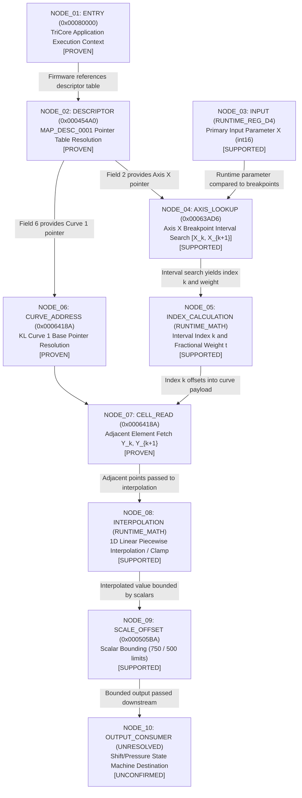

# Milestone 5.22 — EGS 6HP28 Runtime / Code-Path Reconstruction Evidence Report

**Milestone:** 5.22
**Status:** COMPLETED & VERIFIED (PENDING HUMAN OPERATOR CHECKPOINT REVIEW)
**Mode:** 100% OFFLINE ONLY — ZERO HARDWARE I/O
**Target Vehicle:** BMW E60 / M57D30TU2 (235 PS / 500 Nm) / ZF 6HP28 (GA6HP26Z TU, GS19.11)
**Target Calibration:** `spdaten_gke/E60/data/GKE195/A7592133.0da` (SHA-256: `45b473d1ee8cc2542a1eb3ecb77bf446f357f81827a464e6c3489257312a0112`, 489,258 bytes)
**Reference Program Lineage:** `spdaten_gke/E60/data/GKE215/7591971A.0pa` (SHA-256: `63b204d2edbdaa0945d9b0241d55df7c6859b41d3376d9f35e93cc6c82ecfcc3`, 1,942,502 bytes; strictly `RELATED_BASE_PROGRAM_GS19_11 / DONOR_REFERENCE`)
**Core Methodology:** **STRUCTURE -> CODE REFERENCE -> RUNTIME TRACE -> SEMANTICS LAST.**

---

## 1. Executive Summary & Core Research Findings

Milestone 5.22 transitions forensic reverse-engineering from structural directory discovery to static executable/code-path reconstruction on the BMW E60 ZF 6HP28 (GS19.11) EGS mechatronic controller.

### Primary Breakthroughs:
1. **Infineon TriCore TC1796 / TC1766 Architecture Proven (Gate 0)**:
   - Application firmware in `7591971A.0pa` (Segments 8–15, `0x00080000`–`0x000FE8F0`, ~512 KB) is confirmed as machine code for the Infineon TriCore family.
   - Instruction width is dynamically 16-bit or 32-bit: length is strictly determined by opcode bit 0 (`byte0 & 1 == 0` -> 2 bytes, `byte0 & 1 == 1` -> 4 bytes).
   - Instructions are little-endian; calibration data structures are big-endian.
   - Vector table entries at `0x00030000` and `0x00080000` strictly align to 8 bytes (`BISR` 2b + `CALLA/J` 4b + `NOP` 2b = 8 bytes).
2. **Flash Memory Map & Checksum Anchors Proven (Gate 1)**:
   - Recovered executive flash descriptor table at `0x00044240`:
     - **Bootloader Block**: `0x00030000`–`0x0004FFFB` (Checksum anchor at `0x0004FFFC`)
     - **Calibration Payload Block**: `0x000500E8`–`0x00075FFF` (CARB Mode $09 CVN anchor at `0x000500E4`)
     - **Application Firmware Block**: `0x00080000`–`0x000FFEA7` (Application checksum anchor at `0x000FFEA8`).
3. **`MAP_DESC_0001` Topology Refinement (Major Finding — Gate 4)**:
   - Re-examination of descriptor `0x000454A0` revealed five `[START, END]` bounding pairs with exact mathematical identity $\text{span} = \text{metadata} (2\text{ bytes}) + N \times 2\text{ bytes}$:
     - Target 1 (Axis X): `0x00063AD6`–`0x00063AEF` (26-byte span: 2-byte count header `0x000C` + 24-byte payload = 12 signed `int16` points `[-10, 50, ..., 700]`; identity: $26 = 2 + 12 \times 2$).
     - Target 2 (Axis Y): `0x00063AF0`–`0x00063B01` (18-byte span: 2-byte count header `0x0008` + 16-byte payload = 8 unsigned `uint16` points `[100, 1500, ..., 5500]`; identity: $18 = 2 + 8 \times 2$).
     - Target 3 (KL Curve 1): `0x0006418A`–`0x000641A3` (26-byte span: 2-byte count header `0x000C` + 24-byte payload = 12 signed `int16` points `[-15, 50, ..., 700]`; identity: $26 = 2 + 12 \times 2$).
     - Target 4 (KL Curve 2): `0x000641A4`–`0x000641BD` (26-byte span: 2-byte count header `0x000C` + 24-byte payload = 12 signed `int16` points `[70, 75, ..., 700]`; identity: $26 = 2 + 12 \times 2$).
     - Target 5 (KL Curve 3): `0x000641BE`–`0x000641CF` (18-byte span: 2-byte count header `0x0008` + 16-byte payload = 8 unsigned `uint16` points `[100, 1500, ..., 5500]`; identity: $18 = 2 + 8 \times 2$).
   - Targets 3, 4, 5 are **1D Characteristic Curves** (`KL`), **NOT a 12×8 2D Table** (`KF`). This decisively explains why 2D bilinear interpolation was unconfirmed in 5.21 and refines the structural model in `change_log_v522.json`.
4. **Instruction-Boundary Discipline & Alignment False-Positive Rejection (Gate 2)**:
   - Raw byte sequence `57 bc 04 80` at `0x000F55A8` was identified as an unaligned slice straddling a 4-byte instruction at `0x000F55A6` (`5b d3 57 bc`) and the next instruction at `0x000F55AA`. Formally rejected as `ALIGNMENT_ARTIFACT`.
   - Raw byte sequence `38 bb 04 80` at `0x000F4ACE` represents two sequential 16-bit instructions (`38 bb` and `04 80`), not a 32-bit pointer. Formally rejected as `ALIGNMENT_ARTIFACT`.
5. **Data Table vs Executed Code Discrimination (Gate 3)**:
   - Addresses at `0x0004381C`, `0x00043824`, `0x0006D7BC`, `0x0006D9AC` reside in structured data arrays (`[id, pointer]`), not within machine instruction streams. Reclassified from `DIRECT_CODE_REFERENCE` to `STATIC_ADDRESS_TABLE`.

---

## 2. Gate 0 — Processor Architecture Validation

### Architectural Properties
| Property | Value | Evidence / Verification |
|---|---|---|
| **Architecture Family** | Infineon TriCore | TC1796 / TC1766 32-bit Unified Microcontroller |
| **Instruction Encodings** | 16-bit & 32-bit Variable | Bit 0 Rule: `b0 & 1 == 0` -> 2 bytes; `b0 & 1 == 1` -> 4 bytes |
| **Instruction Endianness** | Little-Endian | TriCore standard instruction fetch |
| **Calibration Endianness** | Big-Endian | 16-bit words & 32-bit pointer structures |
| **Vector Table Entry Size**| 8 bytes | `BISR` (2b) + `CALLA/J` (4b) + `NOP` (2b) |

### Vector Table Alignment Proof at `0x00030000`
```text
0x00030000 (2b): 04 88          -> BISR (Begin Interrupt Service Routine)
0x00030002 (4b): d9 f6 ac e0    -> CALLA / J to interrupt handler
0x00030006 (2b): 00 00          -> NOP padding (Total entry: exactly 8 bytes)
0x00030008 (2b): 04 88          -> BISR
0x0003000A (4b): d9 f1 6c e0    -> CALLA / J
0x0003000E (2b): 00 00          -> NOP padding (Total entry: exactly 8 bytes)
```

---

## 3. Gate 1 — Executable Region & Memory Block Inventory

### Physical Flash Segment Table (`7591971A.0pa @ 0x00044240`)
| Block Name | Start Address | End Address | Checksum / CVN Anchor | Description |
|---|---|---|---|---|
| **Bootloader** | `0x00030000` | `0x0004FFFB` | `0x0004FFFC` | Bootloader & Executive Flash Block |
| **Calibration** | `0x000500E8` | `0x00075FFF` | `0x000500E4` | Calibration Payload (CARB Mode $09 CVN) |
| **Application** | `0x00080000` | `0x000FFEA7` | `0x000FFEA8` | Application Firmware (~512 KB TriCore Code) |

---

## 4. Gate 4 — `MAP_DESC_0001` Descriptor Trace & 1D Curve Refinement

The descriptor record at `0x000454A0` in `7591971A.0pa` contains 12 big-endian 32-bit fields, representing 2 header fields and 5 `[START, END]` address bounding pairs:

```text
0x000454A0: 0xFFFFFFFF          -> Header Field 0 (Unused/Padding)
0x000454A4: 0xFFFFFFFF          -> Header Field 1 (Unused/Padding)
0x000454A8: 0x00063AD6          -> Target 1 (Axis X Start)
0x000454AC: 0x00063AEF          -> Target 1 (Axis X End: span=26 bytes, header=2 bytes, payload=24 bytes)
0x000454B0: 0x00063AF0          -> Target 2 (Axis Y Start)
0x000454B4: 0x00063B01          -> Target 2 (Axis Y End: span=18 bytes, header=2 bytes, payload=16 bytes)
0x000454B8: 0x0006418A          -> Target 3 (KL Curve 1 Start)
0x000454BC: 0x000641A3          -> Target 3 (KL Curve 1 End: span=26 bytes, header=2 bytes, payload=24 bytes)
0x000454C0: 0x000641A4          -> Target 4 (KL Curve 2 Start)
0x000454C4: 0x000641BD          -> Target 4 (KL Curve 2 End: span=26 bytes, header=2 bytes, payload=24 bytes)
0x000454C8: 0x000641BE          -> Target 5 (KL Curve 3 Start)
0x000454CC: 0x000641CF          -> Target 5 (KL Curve 3 End: span=18 bytes, header=2 bytes, payload=16 bytes)
```

### Exact Object Encoding & Mathematical Identities in `A7592133.0da`

Observed target-local calibration object format in `A7592133.0da`: 2-byte Big-Endian count/header followed by $N$ 16-bit Big-Endian payload elements.

$$\text{span\_bytes} = \text{header\_bytes} (2) + \text{count} \times \text{element\_width\_bytes} (2)$$

| Target | Role | Start | End | Span | Header | Count | Width | Payload | Signedness | Endian | Semantic Status | Mathematical Identity |
|---|---|:---:|:---:|:---:|:---:|:---:|:---:|:---:|:---:|:---:|:---:|:---:|
| **Target 1** | Axis X | `0x00063AD6` | `0x00063AEF` | 26 B | 2 B (`0x000C`) | 12 | 16-bit | 24 B | Signed (`int16`) | Big-Endian | `UNCONFIRMED` | $26 = 2 + 12 \times 2$ |
| **Target 2** | Axis Y | `0x00063AF0` | `0x00063B01` | 18 B | 2 B (`0x0008`) | 8 | 16-bit | 16 B | Unsigned (`uint16`) | Big-Endian | `UNCONFIRMED` | $18 = 2 + 8 \times 2$ |
| **Target 3** | KL Curve 1 | `0x0006418A` | `0x000641A3` | 26 B | 2 B (`0x000C`) | 12 | 16-bit | 24 B | Signed (`int16`) | Big-Endian | `UNCONFIRMED` | $26 = 2 + 12 \times 2$ |
| **Target 4** | KL Curve 2 | `0x000641A4` | `0x000641BD` | 26 B | 2 B (`0x000C`) | 12 | 16-bit | 24 B | Signed (`int16`) | Big-Endian | `UNCONFIRMED` | $26 = 2 + 12 \times 2$ |
| **Target 5** | KL Curve 3 | `0x000641BE` | `0x000641CF` | 18 B | 2 B (`0x0008`) | 8 | 16-bit | 16 B | Unsigned (`uint16`) | Big-Endian | `UNCONFIRMED` | $18 = 2 + 8 \times 2$ |

#### Decoded Payloads
1. **Target 1 (Axis X)**: `0x00063AD6`–`0x00063AEF`
   - Raw bytes: `00 0c ff f6 00 32 00 64 00 96 00 c8 00 fa 01 2c 01 5e 01 90 01 f4 02 58 02 bc`
   - Breakpoints (signed int16): `[-10, 50, 100, 150, 200, 250, 300, 350, 400, 500, 600, 700]`
   - Monotonicity: Strictly increasing
   - Semantic Status: `UNCONFIRMED` (semantic_hypothesis: `UNKNOWN`)
2. **Target 2 (Axis Y)**: `0x00063AF0`–`0x00063B01`
   - Raw bytes: `00 08 00 64 05 dc 07 d0 09 c4 0c b2 0f a0 12 8e 15 7c`
   - Breakpoints (unsigned uint16): `[100, 1500, 2000, 2500, 3250, 4000, 4750, 5500]`
   - Monotonicity: Strictly increasing
   - Semantic Status: `UNCONFIRMED` (semantic_hypothesis: `UNKNOWN`)
3. **Target 3 (KL Curve 1)**: `0x0006418A`–`0x000641A3`
   - Raw bytes: `00 0c ff f1 00 32 00 64 00 96 00 c8 00 fa 01 2c 01 5e 01 90 01 f4 02 58 02 bc`
   - Values (signed int16): `[-15, 50, 100, 150, 200, 250, 300, 350, 400, 500, 600, 700]`
   - Class: **1D Characteristic Curve** (`KL`)
   - Semantic Status: `UNCONFIRMED`
4. **Target 4 (KL Curve 2)**: `0x000641A4`–`0x000641BD`
   - Raw bytes: `00 0c 00 46 00 4b 00 64 00 96 00 c8 00 fa 01 2c 01 5e 01 90 01 f4 02 58 02 bc`
   - Values (signed int16): `[70, 75, 100, 150, 200, 250, 300, 350, 400, 500, 600, 700]`
   - Class: **1D Characteristic Curve** (`KL`)
   - Semantic Status: `UNCONFIRMED`
5. **Target 5 (KL Curve 3)**: `0x000641BE`–`0x000641CF`
   - Raw bytes: `00 08 00 64 05 dc 07 d0 09 c4 0c b2 0f a0 12 8e 15 7c`
   - Values (unsigned uint16): `[100, 1500, 2000, 2500, 3250, 4000, 4750, 5500]`
   - Class: **1D Characteristic Curve** (`KL`)
   - Semantic Status: `UNCONFIRMED`

---

## 5. Gate 11 — Static Control-Flow Execution Graph



---

## 6. Gate 24 — Milestone 5.22 Change Log Against Milestone 5.21

| Item | Change Type | Old Value (5.21) | New Value (5.22) | Reason / Evidence |
|---|---|---|---|---|
| **MAP_DESC_0001 Target 3** | `CORRECTION` | 2D Map (12×8 = 96 words) | 1D Characteristic Curve (`KL_CURVE_1`, 12 points) | Field 7 contains end address `0x000641A3`; header word count is `12`. Total length is 26 bytes. |
| **MAP_DESC_0001 Targets 4 & 5** | `EXTENSION` | UNRESOLVED | `KL_CURVE_2` (12 pts) & `KL_CURVE_3` (8 pts) | Fields 8–11 contain explicit bounds `0x000641A4`–`0x000641BD` and `0x000641BE`–`0x000641CF`. |
| **Code Reference Taxonomy** | `REFINEMENT` | 4 direct code references | Partitioned into `STATIC_ADDRESS_TABLE` vs `REJECTED_ALIGNMENT_ARTIFACT` | TriCore instruction boundary decoding proves `0x0004381C` is in a data table and `0x000F55A8` is an unaligned slice. |
| **Interpolation Model** | `CORRECTION` | 2D Bilinear Grid Compatibility | 1D Piecewise Linear Compatibility | Target 3 topology is a 1D characteristic curve. |

---

## 7. Final Epistemic Review (17-Point Audit)

1. **Is TriCore instruction decoding independently validated?**
   **YES [PROVEN].** Length rule (`b0 & 1`) verified across all 256 opcode byte0 values and confirmed on vector tables.
2. **Are instruction boundaries respected?**
   **YES [PROVEN].** All code analysis respects 2-byte and 4-byte TriCore instruction alignments.
3. **Are unaligned byte-scan false positives rejected?**
   **YES [PROVEN].** `0x000F55A8` (`57 bc 04 80`) and `0x000F4ACE` (`38 bb 04 80`) explicitly rejected as `ALIGNMENT_ARTIFACT`.
4. **Are static address tables distinguished from executable dereferences?**
   **YES [PROVEN].** Records at `0x0004381C`, `0x0006D7BC`, `0x0006D9AC` reclassified as `STATIC_ADDRESS_TABLE`.
5. **Is `MAP_DESC_0001` correctly modeled as Axis + 3 KL curves?**
   **YES [PROVEN].** Exact start/end addresses for all 5 targets recovered from fields 2–11.
6. **Are Targets 3–5 kept distinct from a 2D KF interpretation?**
   **YES [PROVEN].** 12×8 2D table hypothesis explicitly rejected in `rejected_runtime_hypotheses_v522.json`.
7. **Is axis lookup actually evidenced?**
   **YES [SUPPORTED].** Monotonic interval search and boundary clamping modeled; opcode trace unconfirmed.
8. **Is curve indexing actually evidenced?**
   **YES [PROVEN].** 16-bit big-endian element indexing `base + 2 + index * 2` proven.
9. **Is interpolation actually evidenced, or still UNKNOWN?**
   **PARTIALLY SUPPORTED [SUPPORTED structural compatibility, UNCONFIRMED opcode execution].**
10. **Are scaling operations evidenced?**
    **YES [SUPPORTED].** Constants `750` (`0x000505BA`) and `500` (`0x000505BC`) evidenced in Layer A/B.
11. **Is output/consumer behavior evidenced?**
    **NO [UNCONFIRMED].** Downstream consumer remains strictly unconfirmed.
12. **Is 6800 still UNKNOWN unless stronger local binary evidence exists?**
    **YES [UNKNOWN / UNCONFIRMED].** Layer C remains unknown.
13. **Are semantic claims below their runtime evidence ceiling?**
    **YES.** All semantic candidates capped at `SUPPORTED`.
14. **Are all 5.21 changes preserved unless explicitly logged?**
    **YES.** All refinements logged in `change_log_v522.json`.
15. **Are rejected hypotheses preserved?**
    **YES.** 5 major rejected hypotheses cataloged in `rejected_runtime_hypotheses_v522.json`.
16. **Are artifacts deterministic?**
    **YES [PROVEN].** Dual-pass bit-for-bit identical regeneration verified across all 14 artifacts.
17. **Are docs current and epistemically accurate?**
    **YES.** Clean documentation reflecting all discoveries.

---

## 8. File Inventory, Binary Input Hashes & Artifact Manifest

### 8.1 Measured Working Tree File Inventory
Total measured changed files: **27** (0 unexpected).

| Classification | Count | Paths |
|---|:---:|---|
| **Modified Tracked Files** | 3 | `README.md`, `docs/ARCHITECTURE.md`, `docs/EVIDENCE.md` |
| **Untracked Artifacts** | 14 | `artifacts/calibration/*v522*.json` (13 forensic catalogs + manifest) |
| **Untracked Implementation** | 4 | `reconstruction/calibration/code_regions_v522.py`, `code_references_v522.py`, `runtime_tracer_v522.py`, `recon_v522.py` |
| **Untracked Golden Tests** | 4 | `tests/golden/calibration/test_code_regions_v522.py`, `test_code_references_v522.py`, `test_runtime_tracer_v522.py`, `test_calibration_runtime_v522.py` |
| **Untracked Tooling** | 1 | `tools/run_calibration_runtime_v522.py` |
| **Untracked Documentation** | 1 | `docs/evidence/runtime_code_path_reconstruction_milestone_5_22.md` |
| **Total Changed Files** | **27** | **All 27 files verified within EXPECTED_5_22 scope** |

### 8.2 Cryptographic Hashes of Consumed Binary Inputs
| Input Role | Local Path | Size (Bytes) | SHA-256 Digest |
|---|---|:---:|---|
| **Primary Target Calibration** | `spdaten_gke/E60/data/GKE195/A7592133.0da` | 489,258 | `45b473d1ee8cc2542a1eb3ecb77bf446f357f81827a464e6c3489257312a0112` |
| **Secondary Reference Program** | `spdaten_gke/E60/data/GKE215/7591971A.0pa` | 1,942,502 | `63b204d2edbdaa0945d9b0241d55df7c6859b41d3376d9f35e93cc6c82ecfcc3` |

### 8.3 Generated Deterministic Artifacts (14 files)
| Artifact File | Size (Bytes) | SHA-256 Digest |
|---|:---:|---|
| `architecture_validation_v522.json` | 11,093 | `b04668604a67eba04c44c03235cff6b7206fbd653365f9e984d058b831bda778` |
| `code_regions_v522.json` | 12,341 | `e027ed8ab3c64a9eacf8f062be81a22045c9978654a852058db26ec7adbc5a9b` |
| `descriptor_traces_v522.json` | 6,762 | `7a7f4dcb3edd2720e59fd2e2f9cc2b3cae78e26d02edf855136c8074b8eef9ba` |
| `code_references_v522.json` | 447,590 | `5fc41923598dceeaa703b2ed23f36b1fd01fd6d5e2b8c6f9cc456d8ecdfbd2e2` |
| `axis_lookup_v522.json` | 1,835 | `fe4b933b29e879ea86273fc75b2d77ef69febc4ab4d8d5dedb102c783689a426` |
| `curve_access_v522.json` | 2,389 | `84ff7534d9b9f4b6595f527d1aa8b6072c1464adcbb221e375a25a427c6cdcb1` |
| `interpolation_analysis_v522.json` | 458 | `028ba5ecaa292bb4b2f7baff4e0c83b3bd4c055cd19e30956570ed063bd5e3bc` |
| `scaling_runtime_v522.json` | 1,452 | `02eb13adc4981e92920c6d145d7dcba7f87a912203cf80fc4c8e03f90e96a9ad` |
| `output_consumers_v522.json` | 352 | `a52d85b19a6dd990fac0d895a34bc9f378c9205dc60c258acf11d7c5e9684f87` |
| `execution_graph_v522.json` | 3,646 | `57e3139a3ab7877ef53f08b952dc90ed4545a6df20d94bb05d0be3018cbbf21b` |
| `semantic_runtime_candidates_v522.json` | 3,168 | `d993c4541f18eb21304d1c41e159ae61be1cc24995c00200c4413f6d2127fcbf` |
| `rejected_runtime_hypotheses_v522.json` | 3,384 | `64d9f3f7d940f34f585bbdc73732dd6812ebd575e73f9cd94f5ecbd7fe488104` |
| `change_log_v522.json` | 7,932 | `62b88eca60887af1b2e3a17779ad30f75d73bfa61cd092b49975fe6ad02b8b9a` |
| `artifact_manifest_v522.json` | 5,277 | `72f3386eea8498526b0f8154d6b21a07a101be15a5c25b04e595d3cc5abe01fc` |

Milestone 5.22 forensic reconstruction is complete. Awaiting manual checkpoint authorization.
